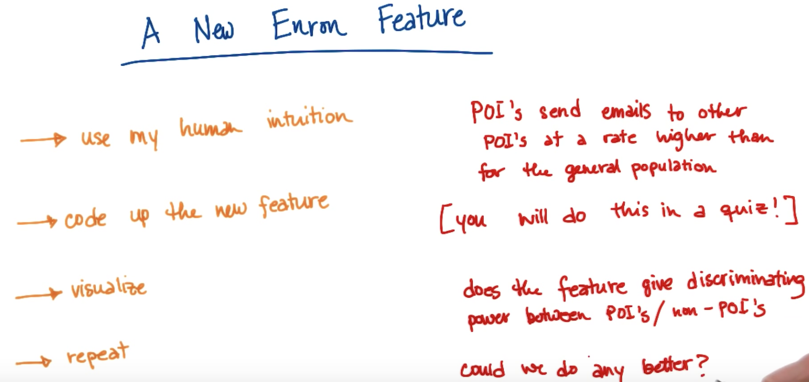
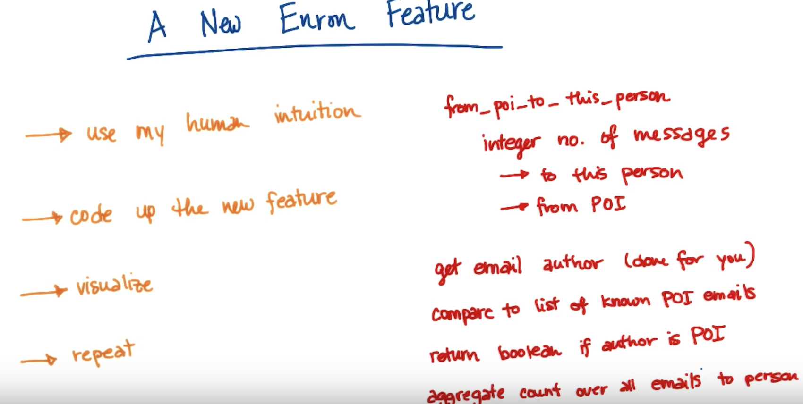

# Feature selection
You should have a way to slecet th best features that are available to you. 
You can also add new features that contains a pattern that you can exploit using machine learning.

## Adding a new feature


All that that code does is, for each email, returns three values (either True or False for each):
to_poi, from_poi, cc_poi
Helper functions extract the 'to', 'cc' and 'from' entries (i.e. email addresses) from an email and stores them in the variables: to_emails, from_emails, cc_emails 
At the start of the relevant function the three return variables are set to false (the default value):
    to_poi = False
    from_poi = False
    cc_poi   = False
Then, the email addresses in the lists to_emails, from_emails, and cc_emails, are compared to the email address in the list poi_emails (i.e. the list of POIs email addresses):
```{python}
    # an empty list has a truth value of false in python
    # if 'to_emails' is empty, this code will not execute
    if to_emails:
        # set a counter
        ctr = 0
        # all we need is to find one poi in the list 'to_emails'
        # and we are done. 
        # Initially 'to_poi' is set to false, once it is set to true, 
        # there is no need to run the code
        while not to_poi and ctr < len(to_emails):
            # loop through the address in 'to_emails' if any are in 'poi_email_list' 
            # set 'to_poi' to True (and no more checking is done).
            if to_emails[ctr] in poi_email_list:
                to_poi = True
            ctr += 1
```

