# Intro to machine learning - Supervised learning

## Decision surface
Algorithm takes in data and creates a decision surface that can predict whther future cases will land in a certain category. 
When the decision surface is a straight line it is linear.
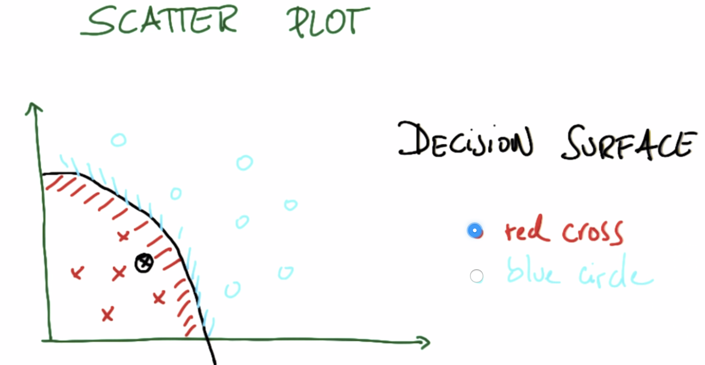 

## Naive Bayes
Use Sci-kit learn Naive Bayes gaussuian function:
```{python}
>>> import numpy as np
>>> X = np.array([[-1, -1], [-2, -1], [-3, -2], [1, 1], [2, 1], [3, 2]]) #training data
>>> Y = np.array([1, 1, 1, 2, 2, 2]) # labels
>>> from sklearn.naive_bayes import GaussianNB
>>> clf = GaussianNB() #classifier
>>> clf.fit(X, Y) # fit calssifier with training data and labels
GaussianNB(priors=None)
>>> print(clf.predict([[-0.8, -1]])) # see which label this would get based on classifier
[1] # classifier predicts the points above would be labelled 1
```

### Example: predict how fast/slow to drive given terrain features
We will use Naive Bayes to classify whether we can drive fast or slow given the
terrain features. 
*Evaluate classifier:*
Evaluate calssifier to see how well it's doing at classifying points. The metric we will use is *accuracy*. The accuracy is the (number of points classified correctly(/(total number of points in the set). 
There are two ways we can do this:
(i) Write code that compares predictions to y_test, element by element OR
(ii) Use SKLearn 
```{python}
def NBAccuracy(features_train, labels_train, features_test, labels_test):
    """ compute the accuracy of your Naive Bayes classifier """
    ### import the sklearn module for GaussianNB
    from sklearn.naive_bayes import GaussianNB
    ### create classifier
    clf = GaussianNB()
    ### note the amount of time to fit data
    t0 = time()
    ### fit the classifier on the training features and labels
    clf.fit(features_train, labels_train)
    print "training time:", round(time()-t0, 3), "s"
    
    t0 = time()
    ### use the trained classifier to predict labels for the test features
    pred = clf.predict(features_test)
    print "prediction time:", round(time()-t0, 3), "s"
    ### calculate and return the accuracy on the test data
    from sklearn.metrics import accuracy_score
    accuracy = accuracy_score(labels_test, pred) 
    # Could also do: print clf.score(features_test, labels_test)
    
    return accuracy
```

## Bayes rule
1% of the population have cancer. If we have a test that:
* 90% will be positive if you have cancer
* 90% of the time will be negative if you don't have cancer.
If you get a positive test result what's the probability you have cancer?
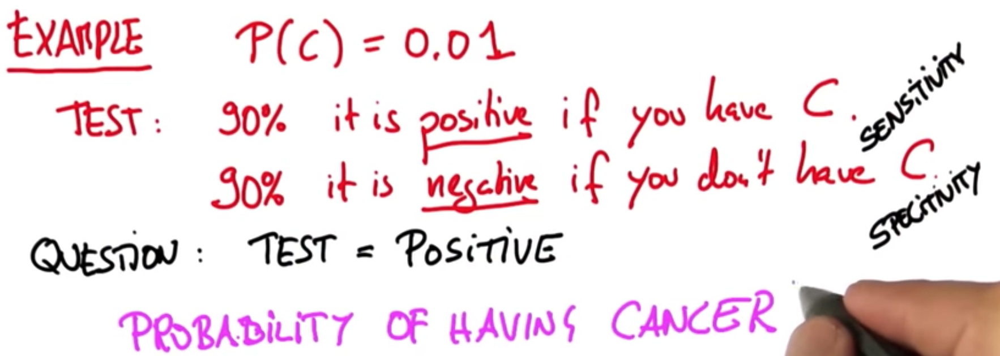 
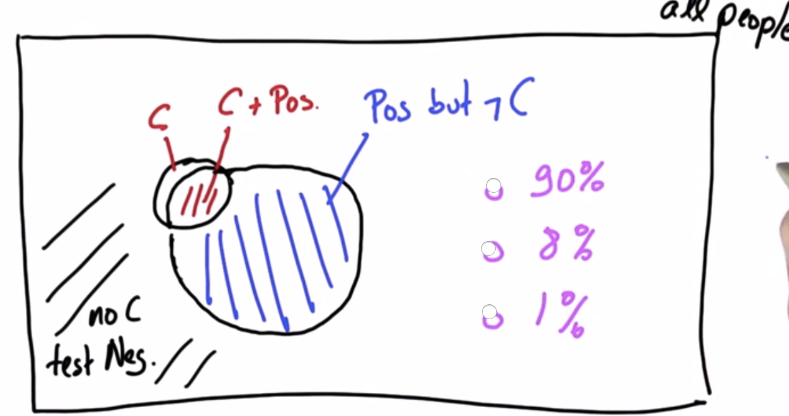 
Both specificity and sensitivity are 90%.  Intuitively, given the test result is 
positive, we know we are in the shaded region (blue and red).  The true positive 
is depicted by red. The answer is 8%

### Prior & posterior
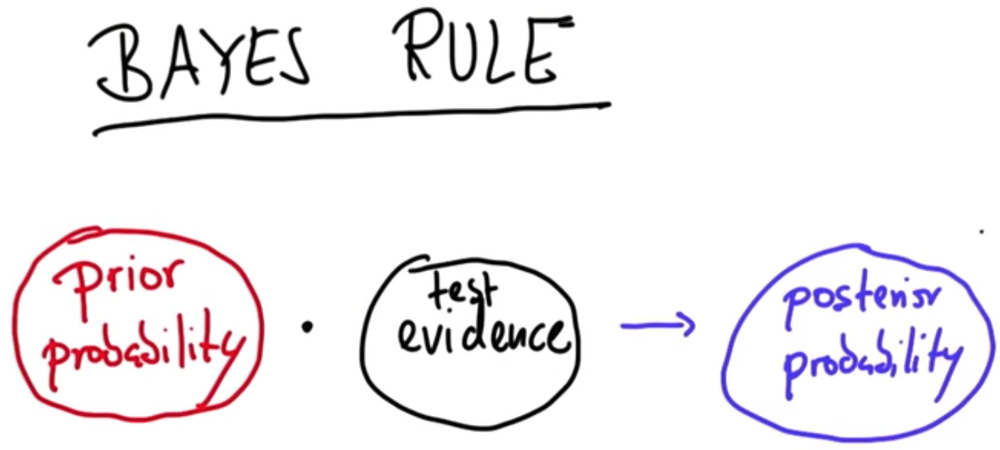 
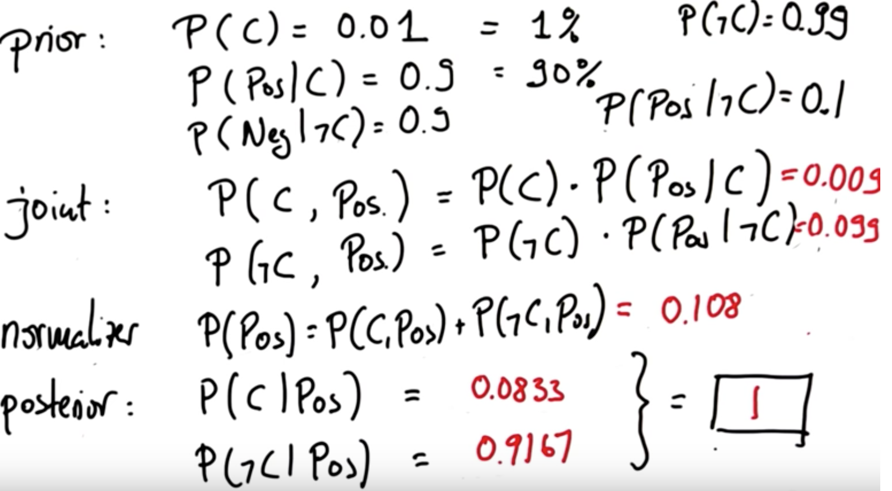 
Summarising the above in a diagram:
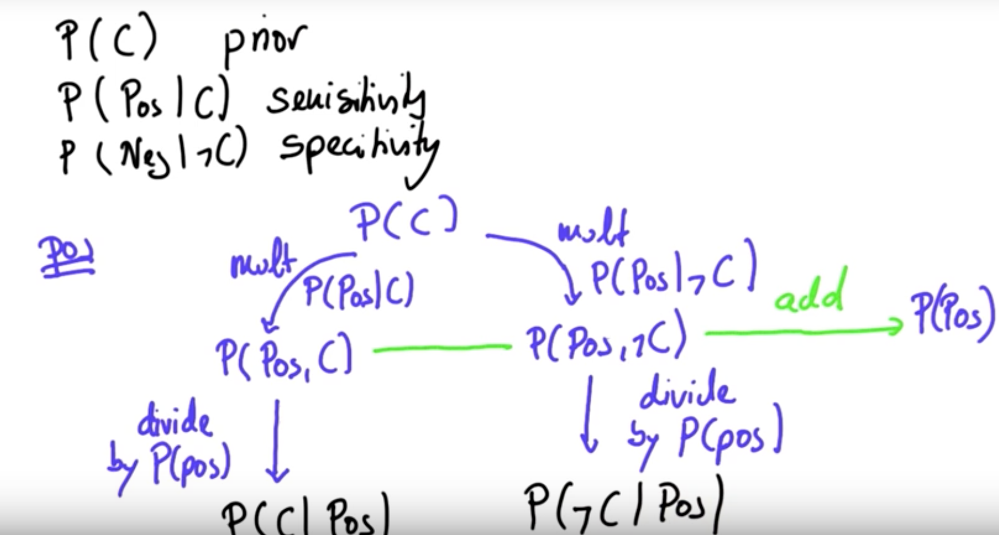
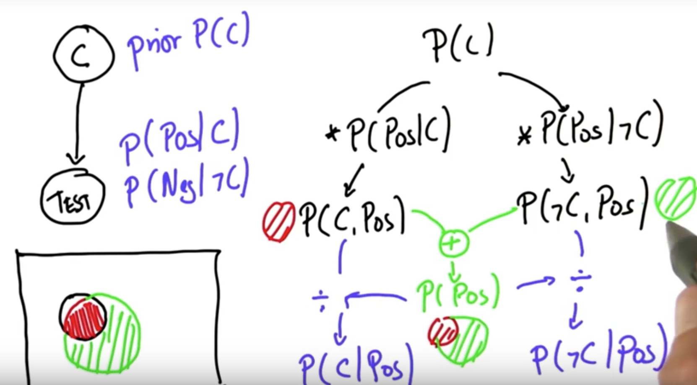 

## Bayes rule for Classification
Say we have two people _ Chris and Sarah. Tey often talk about love, deal and life in their emails 
Chris talks about:
* love 10% of the time
* deal 80% of the time
* life 10% of the time
Sarah talks about:
* love 50% of the time
* deal 20% of the time
* life 30% of the time
Given this information we can use Naive baye to detremine, based on a random email, who's the likely person who sent this email. 
Say we have the email "Life Deal" we ca use Baye's rule to predict who sent this. There's a 50% (prior)probability that either Chris or Sarah sent this email.
(Joint)Probabilty it was Chris: 0.1 . 0.8 . 0.5 = 0.04
(Joint)Probability it was Sarah: 0.3 . 0.2 . 0.5 = 0.03
The posterior probability for Chris is: 0.04/0.07 = 0.57 
The posterior probability for Sarah is: 0.03/0.07 = 0.43

## Pros & cons of Naive Bayes:
* This method ignores the order of words which is actually quite imporatnat in text. It doesn't really understand the text, it just looks at word frequency to do the classification.
* However, it's really easy to implement and simple to run. 
* One particular feature of Naive Bayes is that it’s a good algorithm for working 
with text classification. When dealing with text, it’s very common to treat each unique 
word as a feature, and since the typical person’s vocabulary is many thousands of words, 
this makes for a large number of features. The relative simplicity of the algorithm and the 
independent features assumption of Naive Bayes make it a strong performer for classifying texts. 
* Naive Bayes wouldn't be as good at phrases. for example, if you were ooking up the team Chicago Bulls you don't want results of just bulls or the city of Chicago so it wouldn't work well in a case like this. 
* So make sure if you're going to use it that it suits the question you're going to ask and test it.

### Naive Bayes mini project
```{python}
from sklearn.naive_bayes import GaussianNB
clf = GaussianNB()
t0 = time()
clf.fit(features_train, labels_train)
print "training time:", round(time()-t0, 3), "s"

t0 = time()
pred = clf.predict(features_test)
print "prediction time:", round(time()-t0, 3), "s"
from sklearn.metrics import accuracy_score
accuracy = accuracy_score(labels_test, pred)
print accuracy
```
=> Yields 97.3% accuracy
=> training time: 1.473 s
=> prediction time: 0.165 s

***

# Support Vector Machines (SVMs)
Finds a seperating line (Hyperplane) between data of two classes. 

* Greater margin means it will be more *robust* in terms of minimising classification errors. 
* SVM first makes sure to get the correct classification and then maximises the margin.
* Can also tolerate indivdual outliers. 
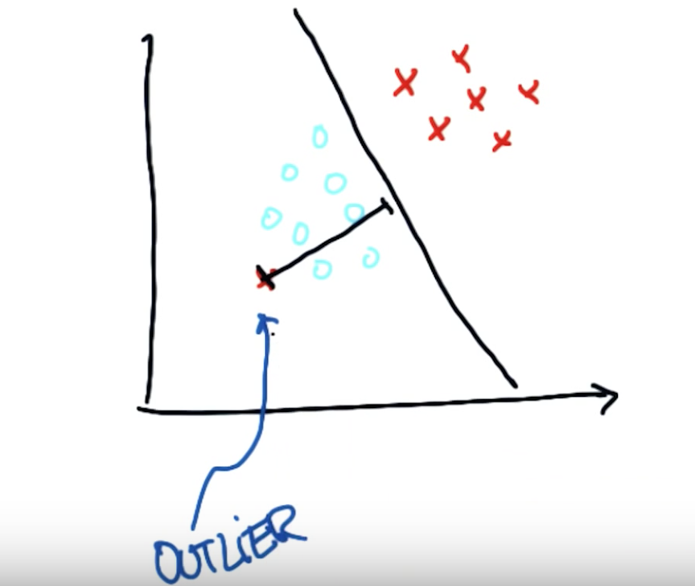

### The advantages of support vector machines are:
* Effective in high dimensional spaces.
* Still effective in cases where number of dimensions is greater than the number of samples.
* Uses a subset of training points in the decision function (called support vectors), so it is also memory efficient.
* Versatile: different Kernel functions can be specified for the decision function. Common kernels are provided, but it is also possible to specify custom kernels.

### The disadvantages of support vector machines include:
* If the number of features is much greater than the number of samples, avoid over-fitting in choosing Kernel functions and regularization term is crucial.
* SVMs do not directly provide probability estimates, these are calculated using an expensive five-fold cross-validation.

Takes as input two arrays: an array X of size [n_samples, n_features] holding the training samples, and an array y of class labels (strings or integers), size [n_samples]:
```{python}
>>>
>>> from sklearn import svm
>>> X = [[0, 0], [1, 1]]
>>> y = [0, 1]
>>> clf = svm.SVC()
>>> clf.fit(X, y)  
SVC(C=1.0, cache_size=200, class_weight=None, coef0=0.0,
    decision_function_shape='ovr', degree=3, gamma='auto', kernel='rbf',
    max_iter=-1, probability=False, random_state=None, shrinking=True,
    tol=0.001, verbose=False)
```
After being fitted, the model can then be used to predict new values:
```{python}
>>>
>>> clf.predict([[2., 2.]])
array([1])
```

## Non linear SVM
We don't need a straight line for seperating data with SVMs. We can add a new non linear feature to seperate data. 
In the example below we add a new feature x^2 + y^2 in order to make the data linearly seperable.
(This essentialy gives us the distance from the origin)
This leads to the mapping between z and y which is depucted in the graph in the upper right corner of image below.
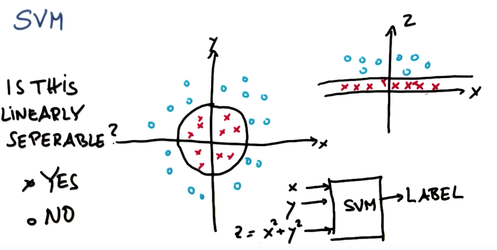

Question: Which new feature would allow us to seperate the values in the graph below?
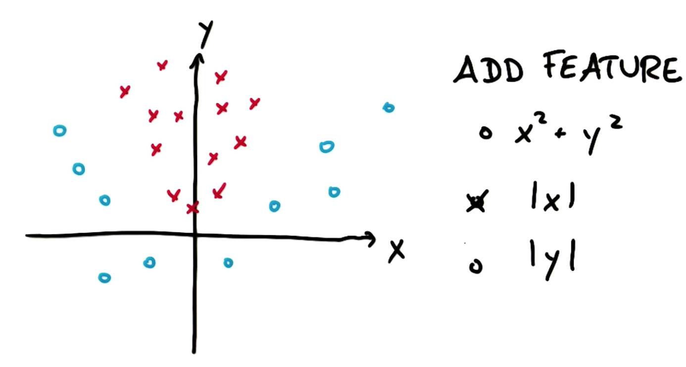
The answer is to map the values of x to |x| as it would give us the chart below:
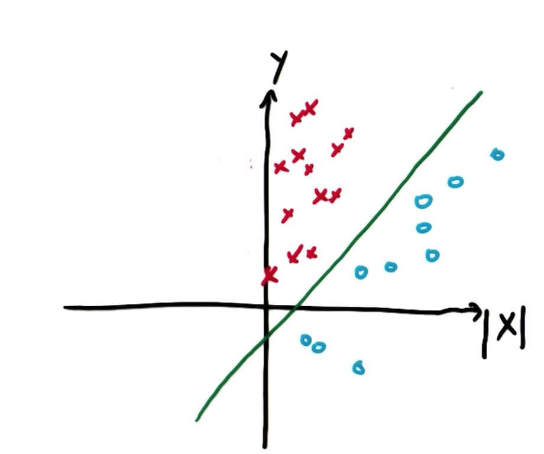

## Kernels
We can use kernels to do this mapping into higher dimensional space allowing you to seperate data using a non linear seperation. 
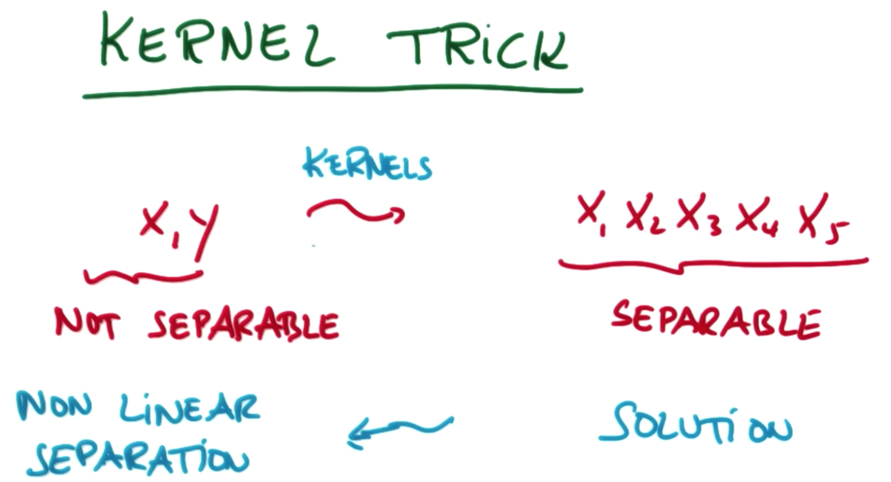
You can pass in what kernel you would like to use as a parameter when setting the classifier. There are multiple kernels to choose from including: linear, poly, rbf etc. as well the option to create your own custom kernel. 

## SVM parameters
* Some of the most important parameters for an SVM include: Kernel, C and gamma. 
* The 'gamma' parameter actually has no effect on the 'linear' kernel for SVMs. The key parameter for linear kernel functions is "C".
* *C* controls the trade off between a smooth decision boundary and classifying training points correctly. The higher the value of C the more training points will be correct, i.e. you'll get a more intricate boundary line with a large value for C where it can wiggle around individual data points to get evrything correct but at the cost of it could be more complex than you'd like it.
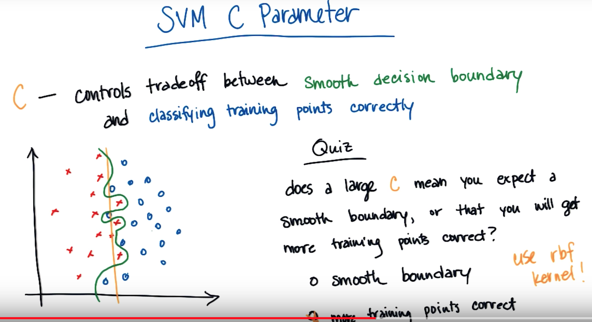
* *gamma* Defines how far the influence of a single training example reaches. If you have a high gamma then the decision boundary details are going to be dependent on the points that are very close to it, which leaves it effectively ignoring the points taht fall far away from the decision boundary. 
* On the other hand, if we have a low value for gamma then even the far away points get takn into consideration when deciding where to draw the decision boundary. 
* For high values of gamma you can end up with a wiggly decision boundary. 
* If we have a low value for gamma then the points near the decision boundary have a low weighting on deciding where to draw the deciso boundary. This makes the decision boundary a little more smoother (as in image below).
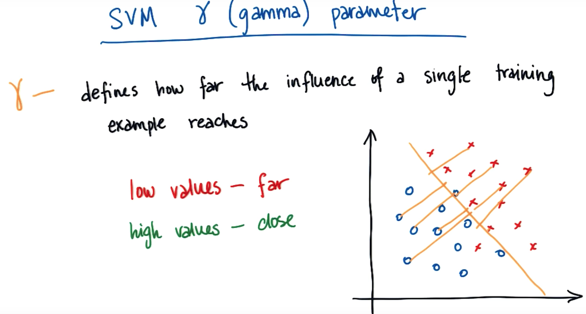

## Overfitting
We can end up using machine learning that fits the training points to an erratic looking boundary when a much simpler one would do well, as in image below. You can control overfitting with the C, gamma and kernel parameters.
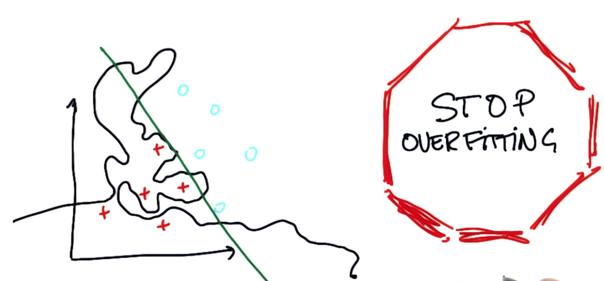

## SVM strengths and weaknesses
* Work well in complicated domains with a clear margin of seperation 
* Don't perform as well in very large data sets or when there's lots of noise in the data. 
* If you have a large data set with lots of features then SVM might be quite slow and prone to overfitting to the noise in the data.

## SVM mini project
```{python}
from sklearn.svm import SVC
clf = SVC(kernel='linear')
t0 = time()
clf.fit(features_train, labels_train)
print "training time:", round(time()-t0, 3), "s"

t0 = time()
pred = clf.predict(features_test)
print "prediction time:", round(time()-t0, 3), "s"
from sklearn.metrics import accuracy_score
accuracy = accuracy_score(labels_test, pred)
print accuracy
```
=> Yields 98.4% accuracy
=>training time: 154.859 s
=>prediction time: 15.911 s

* SVM is MUCH slower than Naive Bayes.
* One way to speed up an algorithm is to train it on a smaller training dataset. The tradeoff is that the accuracy almost always goes down when you do this. Let’s explore this more concretely: add in the following two lines immediately before training your classifier. 
```{python}
features_train = features_train[:len(features_train)/100] 
labels_train = labels_train[:len(labels_train)/100] 
```
=> Yields 88.4% accuracy
=> training time: 0.104 s
=> prediction time: 1.137 s
These lines effectively slice the training dataset down to 1% of its original size, tossing out 99% of the training data. If speed is a major consideration (and for many real-time machine learning applications, it certainly is) then you may want to sacrifice a bit of accuracy if it means you can train/predict faster.

### Changing kernel:
* Changing the kernel to rbf using the smaller training set aove:
=> Yields 61% accuracy
=> training time: 0.109 s
=> prediction time: 1.137 s

### Optimising C value
* Keep the training set size and rbf kernel from the last quiz, but try several values of C (say, 10.0, 100., 1000., and 10000.). Which one gives the best accuracy?

|               | C=10  | C=100  |C=1000  |C=1000 |
| ------------- |:------:| -----:| -----:| -----:|
| Accuracy      |0.616  | 0.616 | 0.821| 0.892|
| Training time | 0.107  |  0.109 | 0.104 | 0.104|
| Prediction time | 1.14 | 1.113 | 1.073|0.902|

* Now that you’ve optimized C for the RBF kernel, go back to using the full training set. In general, having a larger training set will improve the performance of your algorithm, so (by tuning C and training on a large dataset) we should get a fairly optimized result. What is the accuracy of the optimized SVM?
=> Yields 99% accuracy
=> training time: 110.28 s
=> prediction time: 12.916 s

* What class does your SVM (0 or 1, corresponding to Sara and Chris respectively) predict for element 10 of the test set? The 26th? The 50th? (Use the RBF kernel, C=10000, and 1% of the training set. 
```{python}
print pred[10]
print pred[26]
print pred[50]
```

* There are over 1700 test events--how many are predicted to be in the “Chris” (1) class? (Use the RBF kernel, C=10000., and the full training set.)
```{python}
print sum(pred)
```


Hopefully it’s becoming clearer what Sebastian meant when he said Naive Bayes is great for text--it’s faster and generally gives better performance than an SVM for this particular problem. Of course, there are plenty of other problems where an SVM might work better. Knowing which one to try when you’re tackling a problem for the first time is part of the art and science of machine learning. In addition to picking your algorithm, depending on which one you try, there are parameter tunes to worry about as well, and the possibility of overfitting (especially if you don’t have lots of training data).

Our general suggestion is to try a few different algorithms for each problem. Tuning the parameters can be a lot of work, but just sit tight for now--toward the end of the class we will introduce you to GridCV, a great sklearn tool that can find an optimal parameter tune almost automatically.

***

# Decision Trees
Decision Trees (DTs) are a non-parametric supervised learning method used for classification and regression. The goal is to create a model that predicts the value of a target variable by learning simple decision rules inferred from the data features.
Decision trees allow you to ask multiple linear questions, one after the other. 
e.g. Only want to go windsurfing when it's sunny and windy:
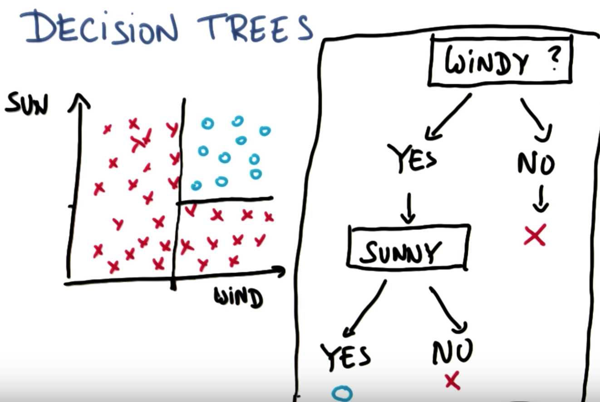
Another e.g:
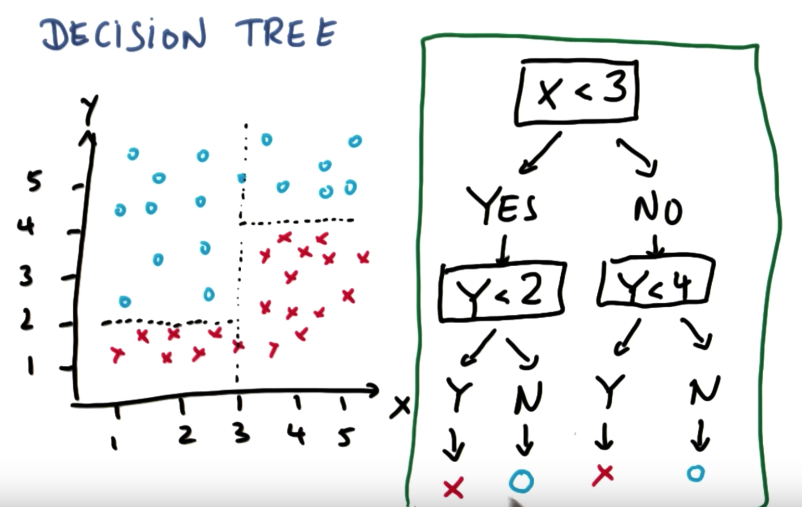

Starter code:
```{python}
>>>
>>> from sklearn import tree
>>> X = [[0, 0], [1, 1]]
>>> Y = [0, 1]
>>> clf = tree.DecisionTreeClassifier()
>>> clf = clf.fit(X, Y)
```
After being fitted, the model can then be used to predict the class of samples:
```{python}
>>>
>>> clf.predict([[2., 2.]])
array([1])
```

## Decision tree parameters
* *min_sample_split*: `decide whether or not to continue splitting the bottom most part of the tree (see pic below)
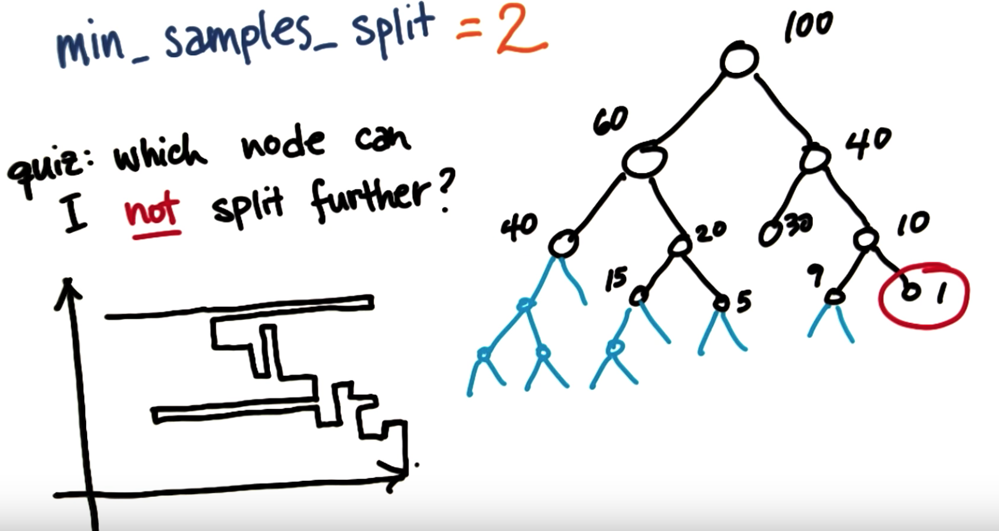

* Going quite far down the tree can lead to overplotiing of your data. Setting ahigher value for min_sample_splitting can help alleviate this.
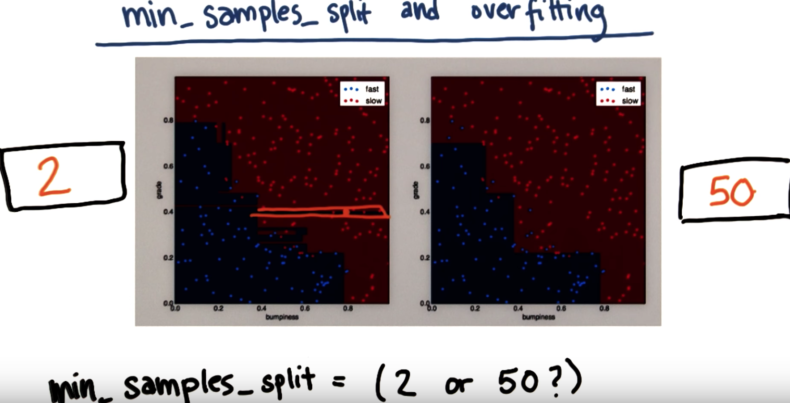

## Entropy
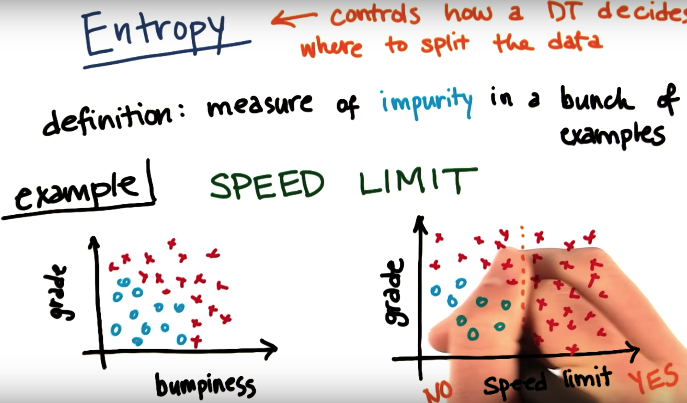
e.g. If speed limit is in effect, it doesn't matter you'll just be slow. whereas if the speed limit isn't in effect you can go fast when the terrain is good.

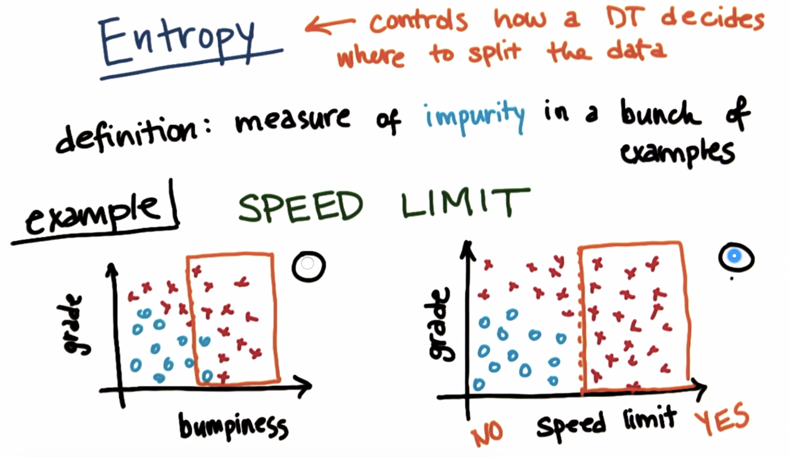
I can split based on bumpiness or the speed limit. Let's say we're only going to compare a half of each graph. The second graph has more purity, i.e. more data of one paticular class. 


### Formula for entropy
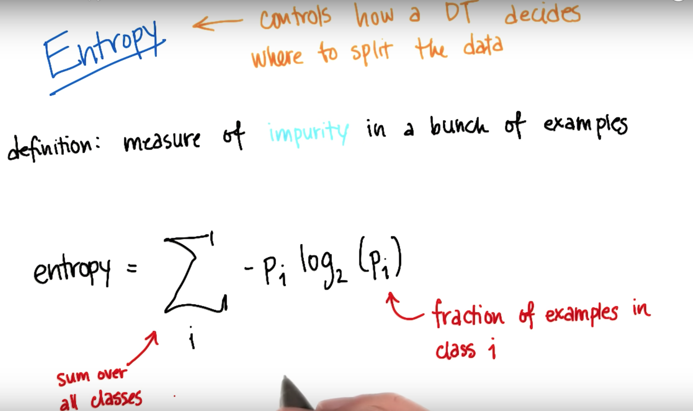
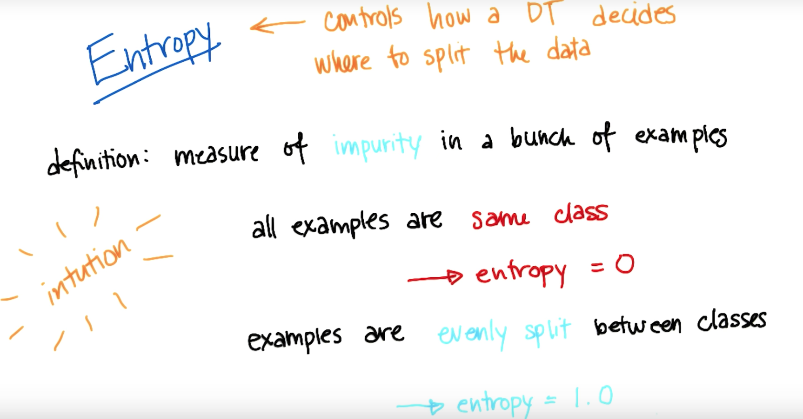

Some sources use other bases for the logarithm (for example, they might use log base 10 or the natural log, with a base of approx. 2.72)--those details can change the maximal value of entropy that you can get. In our case, where there are 2 classes, the log base 2 formula that we use will have a maximal value of 1.
In practice, when you use a decision tree, you will rarely have to deal with the details of the log base--the important takeaway here is that lower entropy points toward more organized data, and that a decision tree uses that as a way how to classify events. 

Let's work through an example:
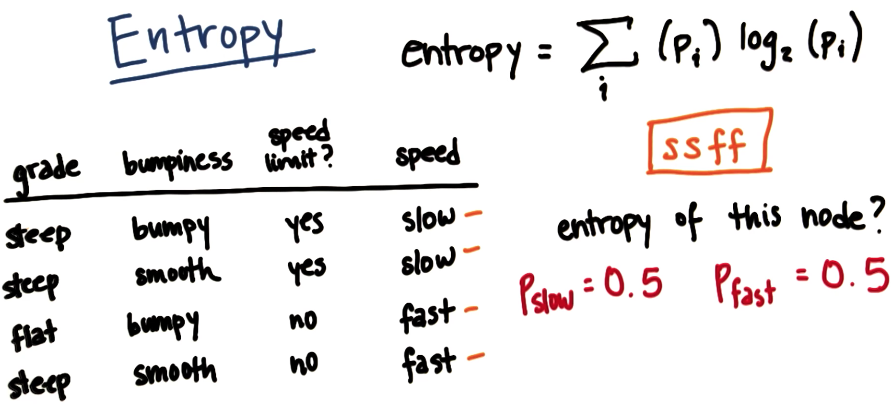
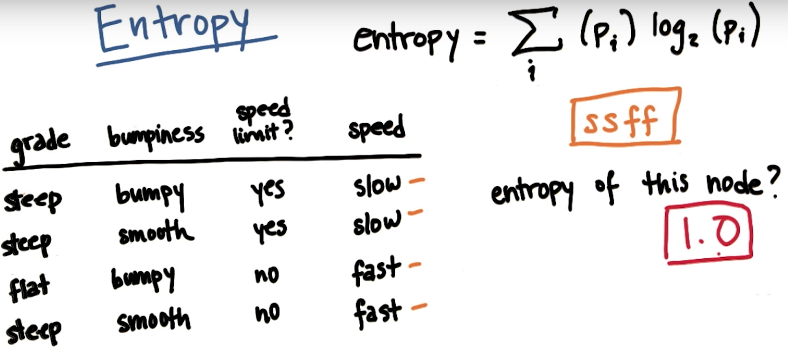

## Information gain


Let's do an example. We can split the parent tree based on the grade:

First, calculate the entropy of the children nodes. So for a steep/flat slope how many are fast/slow
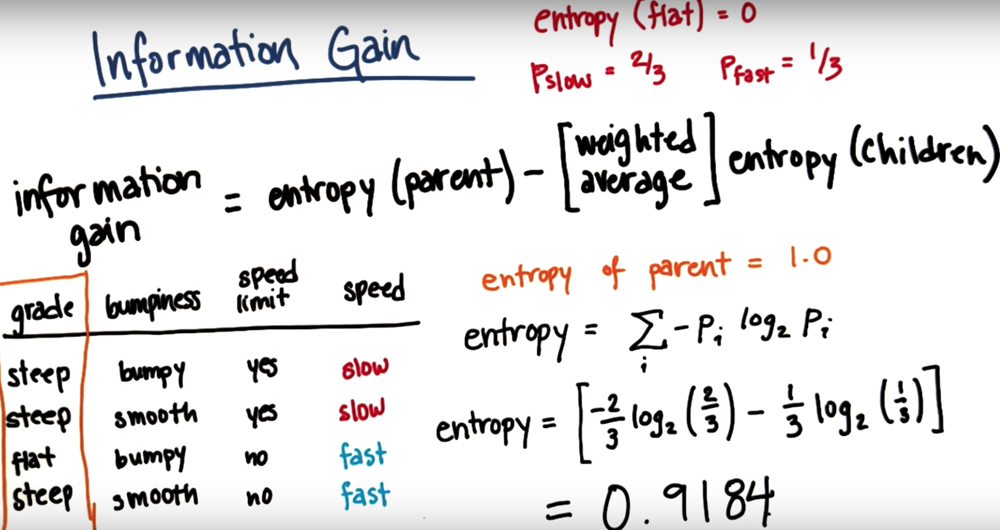
Then calculate the information gain by subtracting the entropy of the children from the entropy of the parent node.
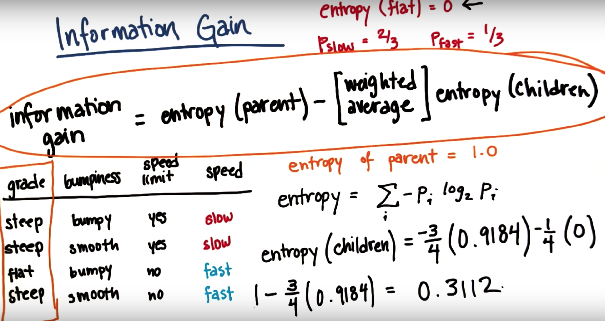

* We can also do this calulation when we split on bumpiness. Doing the information gain calculation we find out that we get an information gain of 0 so this would not be a good place to split our tree since we don't gain any more info by doing so. 
* If we split on speed lilit we get perfect purity so our information gain will be 1 so we would definitely want to make a split here.
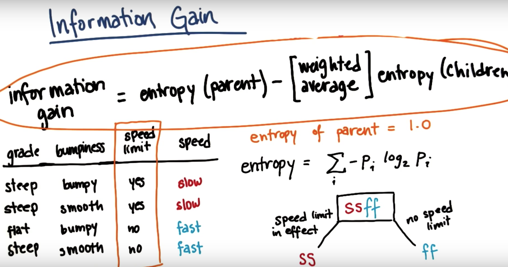
* Note in sklearn the criterion paramater is the function to measure the quality of a split. Supported criteria are “gini” for the Gini impurity and “entropy” for the information gain. Gini is the default for Sklearn.

## Bias-Variance
* A high Bias ML algorithm practically ignores the data, it has almost no capacity to learn anything. This is bad for ML.
* You could go the othe way and have an algorithm that is extremely perceptive to data and can only replicate stuff it's seen before. This would be a extremely high variance algorithm. This will react very poorly in situations it hasn't seen before. 
* In reality we want something in the middle. 

## Decision trees strengths and weakness
* Very easy to use and graphically easy to interpret. 
* You can buid bigger classifiers out of decision trees in ensemble methods.
* Downside: prone to overfitting, especially if you have data that has lots of features and a complicated decision tree can overfit the data. Have to be careful with the parameter tunes that you're picking to prevent this from happening. 

## Decision tree mini project
In this project, we will again try to identify the authors in a body of emails, this time using a decision tree.
Using the starter code, get a decision tree up and running as a classifier, setting min_samples_split=40. It will probably take a while to train. What’s the accuracy?
```{python}
from sklearn import tree
from sklearn.metrics import accuracy_score

clf = tree.DecisionTreeClassifier(min_samples_split=40)
t0 = time()
clf = clf.fit(features_train, labels_train)
print "training time:", round(time()-t0, 3), "s"

t0 = time()
pred = clf.predict(features_test)
print "prediction time:", round(time()-t0, 3), "s"

accuracy = accuracy_score(pred, labels_test)
print accuracy
```
=> Accuracy 97.89%
=> training time: 48.222 s
=> prediction time: 0.028 s

* You found in the SVM mini-project that the parameter tune can significantly speed up the training time of a machine learning algorithm. A general rule is that the parameters can tune the complexity of the algorithm, with more complex algorithms generally running more slowly.
Another way to control the complexity of an algorithm is via the number of features that you use in training/testing. The more features the algorithm has available, the more potential there is for a complex fit. We will explore this in detail in the “Feature Selection” lesson, but you’ll get a sneak preview now.

* What's the number of features in your data? (Hint: the data is organized into a numpy array where the number of rows is the number of data points and the number of columns is the number of features; so to extract this number, use a line of code like len(features_train[0]). )
=> Number of features: 3785

* go into ../tools/email_preprocess.py, and find the line of code that looks like this:
selector = SelectPercentile(f_classif, percentile=10)
Change percentile from 10 to 1, and rerun dt_author_id.py. What’s the number of features now?
=> Number of features: 379

***

# Choose your own algorithm
A critical skill for any data analyst is the ability to figure out new things about machine learning, which is the goal for this lesson. The whole lesson is a mini-project. The goal is to do terrain classification with an algorithm of your choice, researching and deploying it on your own.

Your algorithm choices are the following:
* k nearest neighbors
* random forest
* adaboost (sometimes also called boosted decision tree)
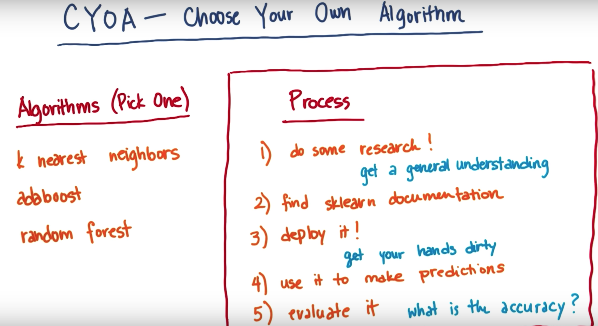

***

## K nearest neighbors algorithm
* k-NN is a type of instance-based learning, or lazy learning, where the function is only approximated locally and all computation is deferred until classification. The k-NN algorithm is among the simplest of all machine learning algorithms.
* The principle behind nearest neighbor methods is to find a predefined number of training samples closest in distance to the new point, and predict the label from these. The number of samples is a user-defined constant.
* Both for classification and regression, a useful technique can be to assign weight to the contributions of the neighbors, so that the nearer neighbors contribute more to the average than the more distant ones. For example, a common weighting scheme consists in giving each neighbor a weight of 1/d, where d is the distance to the neighbor.
* The neighbors are taken from a set of objects for which the class (for k-NN classification) or the object property value (for k-NN regression) is known. This can be thought of as the training set for the algorithm, though no explicit training step is required.
* The training examples are vectors in a multidimensional feature space, each with a class label. The training phase of the algorithm consists only of storing the feature vectors and class labels of the training samples.
* In the classification phase, k is a user-defined constant, and an unlabeled vector (a query or test point) is classified by assigning the label which is most frequent among the k training samples nearest to that query point.
* The best choice of k depends upon the data; generally, larger values of k reduce the effect of noise on the classification,but make boundaries between classes less distinct.
* Being a non-parametric method, it is often successful in classification situations where the decision boundary is very irregular.

### Sklearn docs for k nearest neighbors

```{python}
# loading library
from sklearn.neighbors import KNeighborsClassifier

# instantiate learning model (k = 3)
knn = KNeighborsClassifier(n_neighbors=3)

# fitting the model
knn.fit(X_train, y_train)

# predict the response
pred = knn.predict(X_test)

from sklearn.metrics import accuracy_score
# evaluate accuracy
print accuracy_score(y_test, pred)
```

### Parameter Tuning with Cross Validation
In this section, we’ll explore a method that can be used to tune the hyperparameter K.

Obviously, the best K is the one that corresponds to the lowest test error rate, so let’s suppose we carry out repeated measurements of the test error for different values of K. Inadvertently, what we are doing is using the test set as a training set! This means that we are underestimating the true error rate since our model has been forced to fit the test set in the best possible manner. Our model is then incapable of generalizing to newer observations, a process known as overfitting. Hence, touching the test set is out of the question and must only be done at the very end of our pipeline.

An alternative and smarter approach involves estimating the test error rate by holding out a subset of the training set from the fitting process. This subset, called the validation set, can be used to select the appropriate level of flexibility of our algorithm! There are different validation approaches that are used in practice, and we will be exploring one of the more popular ones called k-fold cross validation.
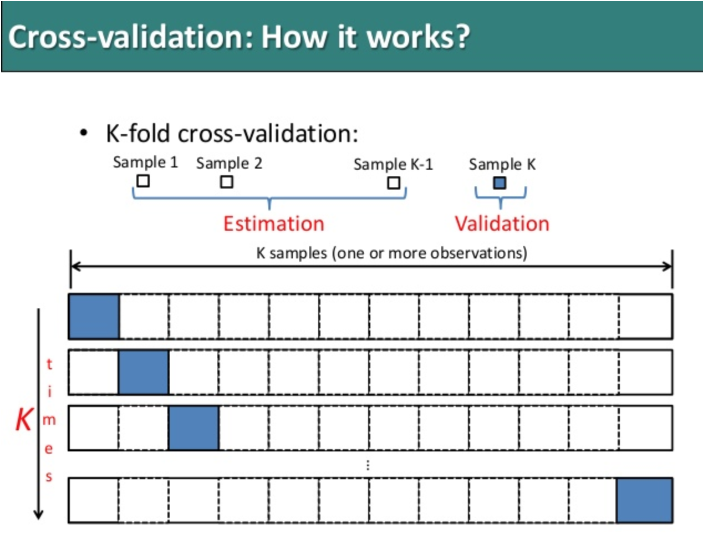
As seen in the image, k-fold cross validation (the k is totally unrelated to K) involves randomly dividing the training set into k groups, or folds, of approximately equal size. The first fold is treated as a validation set, and the method is fit on the remaining k−1k−1 folds. The misclassification rate is then computed on the observations in the held-out fold. This procedure is repeated k times; each time, a different group of observations is treated as a validation set. This process results in k estimates of the test error which are then averaged out.

Cross-validation can be used to estimate the test error associated with a learning method in order to evaluate its performance, or to select the appropriate level of flexibility.

If that is a bit overwhelming for you, don’t worry about it. We’re gonna make it clearer by performing a 10-fold cross validation on our dataset using a generated list of odd K’s ranging from 1 to 50.
```{python}
# creating odd list of K for KNN
myList = list(range(1,50))

# subsetting just the odd ones
neighbors = filter(lambda x: x % 2 != 0, myList)

# empty list that will hold cv scores
cv_scores = []

# perform 10-fold cross validation
for k in neighbors:
    knn = KNeighborsClassifier(n_neighbors=k)
    scores = cross_val_score(knn, X_train, y_train, cv=10, scoring='accuracy')
    cv_scores.append(scores.mean())
```
Again, scikit-learn comes in handy with its cross_val_score() method. We specifiy that we are performing 10 folds with the cv=10 parameter and that our scoring metric should be accuracy since we are in a classification setting.

Finally, we plot the misclassification error versus K.
```{python}
# changing to misclassification error
MSE = [1 - x for x in cv_scores]

# determining best k
optimal_k = neighbors[MSE.index(min(MSE))]
print "The optimal number of neighbors is %d" % optimal_k

# plot misclassification error vs k
plt.plot(neighbors, MSE)
plt.xlabel('Number of Neighbors K')
plt.ylabel('Misclassification Error')
plt.show()
```
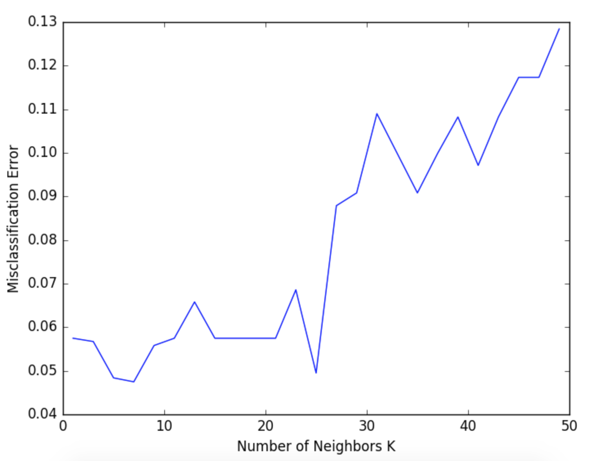
10-fold cross validation tells us that K=7K=7 results in the lowest validation error.

### Using KNN on Udacity mini project

=> Accuracy 93.6% (using n_neighbors=3)
=> training time: 0.008 s
=> prediction time: 0.003 s 

***

## Adaboost algorithm
AdaBoost, short for Adaptive Boosting, is a machine learning meta-algorithm. It can be used in conjunction with many other types of learning algorithms to improve performance. The output of the other learning algorithms ('weak learners') is combined into a weighted sum that represents the final output of the boosted classifier. AdaBoost is sensitive to noisy data and outliers. In some problems it can be less susceptible to the overfitting problem than other learning algorithms. The individual learners can be weak, but as long as the performance of each one is slightly better than random guessing, the final model can be proven to converge to a strong learner.

```{python}
from sklearn.ensemble import AdaBoostClassifier
from sklearn.tree import DecisionTreeClassifier

bdt = AdaBoostClassifier(DecisionTreeClassifier(max_depth=1),
                                                algorithm ="SAMME",
                                                n_estimators=200)
t0=time()
bdt.fit(features_train, labels_train)
print "train time:", round(time()-t0, 3), "s"

t0=time()
pred = bdt.predict(features_test)
print "pred time:", round(time()-t0, 3), "s"
accuracy= accuracy_score(pred, labels_test)
print accuracy
```
=> accuracy: 92.4%
=> train time: 0.616 s
=> pred time: 0.011 s

***

## Random forest algorithm
Random forests or random decision forests are an ensemble learning method. Random forest classifier creates a set of decision trees from randomly selected subset of training set. It then aggregates the votes from different decision trees to decide the final class of the test object.
Suppose training set is given as : [X1, X2, X3, X4] with corresponding labels as [L1, L2, L3, L4], random forest may create three decision trees taking input of subset for example,
1. [X1, X2, X3]
2. [X1, X2, X4]
3. [X2, X3, X4]
So finally, it predicts based on the majority of votes from each of the decision trees made. This works well because a single decision tree may be prone to a noise, but aggregate of many decision trees reduce the effect of noise giving more accurate results.
Alternatively, the random forest can apply weight concept for considering the impact of result from any decision tree. Tree with high error rate are given low weight value and vise versa.

```{python}
from sklearn.ensemble import RandomForestClassifier
clf = RandomForestClassifier(max_depth=2, random_state=0)
t0=time()
clf.fit(features_train, labels_train)
print "train time:", round(time()-t0, 3), "s"

t0=time()
pred = clf.predict(features_test)
print "pred time:", round(time()-t0, 3), "s"
accuracy=accuracy_score(pred, labels_test)
print accuracy
```
=> Accuracy: 92%
=> train time: 0.035 s
=> pred time: 0.001 s


This cheat sheet from Sklearn can come in use when deciding what algorithm to use
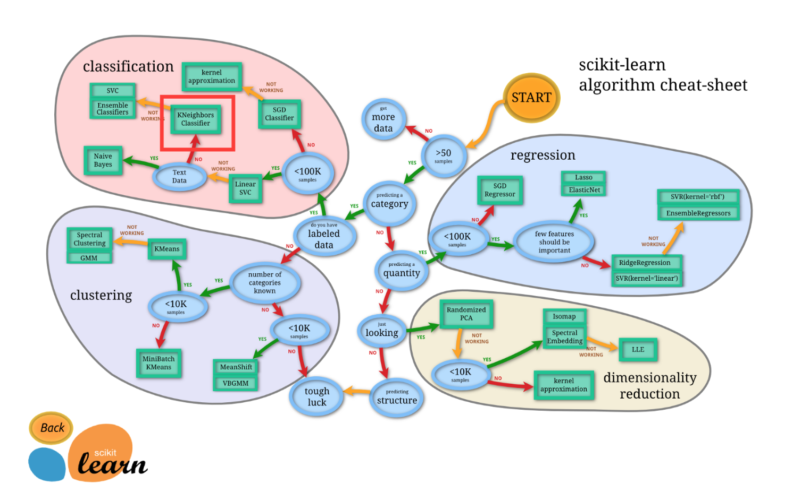