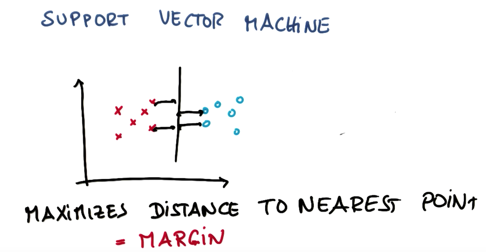
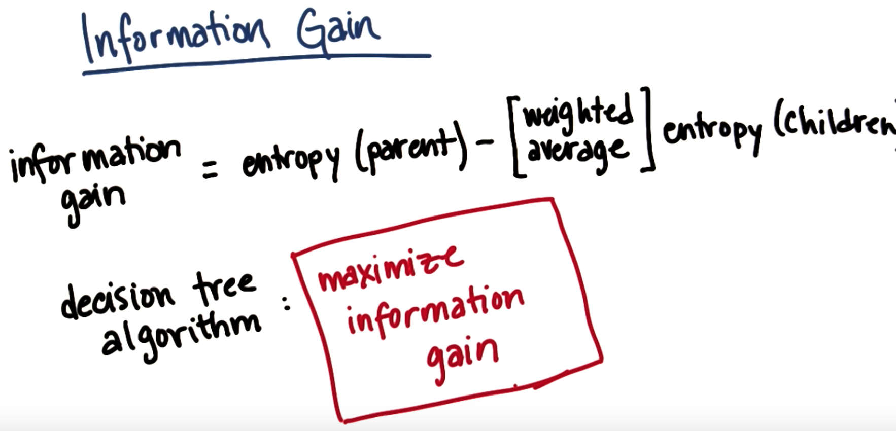
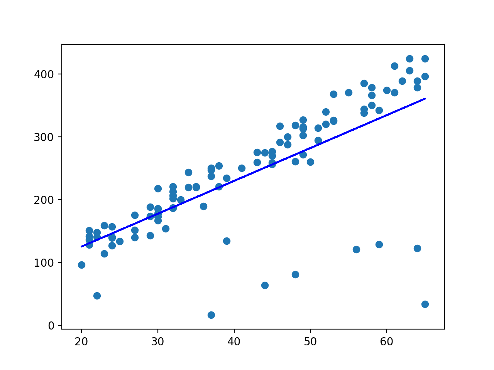

# Intro to machine learning - Supervised learning

## Decision surface
Algorithm takes in data and creates a decision surface that can predict whther future cases will land in a certain category. 
When the decision surface is a straight line it is linear.
 

## Naive Bayes
Use Sci-kit learn Naive Bayes gaussuian function:
```{python}
>>> import numpy as np
>>> X = np.array([[-1, -1], [-2, -1], [-3, -2], [1, 1], [2, 1], [3, 2]]) #training data
>>> Y = np.array([1, 1, 1, 2, 2, 2]) # labels
>>> from sklearn.naive_bayes import GaussianNB
>>> clf = GaussianNB() #classifier
>>> clf.fit(X, Y) # fit calssifier with training data and labels
GaussianNB(priors=None)
>>> print(clf.predict([[-0.8, -1]])) # see which label this would get based on classifier
[1] # classifier predicts the points above would be labelled 1
```

### Example: predict how fast/slow to drive given terrain features
We will use Naive Bayes to classify whether we can drive fast or slow given the
terrain features. 
*Evaluate classifier:*
Evaluate calssifier to see how well it's doing at classifying points. The metric we will use is *accuracy*. The accuracy is the (number of points classified correctly(/(total number of points in the set). 
There are two ways we can do this:
(i) Write code that compares predictions to y_test, element by element OR
(ii) Use SKLearn 
```{python}
def NBAccuracy(features_train, labels_train, features_test, labels_test):
    """ compute the accuracy of your Naive Bayes classifier """
    ### import the sklearn module for GaussianNB
    from sklearn.naive_bayes import GaussianNB
    ### create classifier
    clf = GaussianNB()
    ### note the amount of time to fit data
    t0 = time()
    ### fit the classifier on the training features and labels
    clf.fit(features_train, labels_train)
    print "training time:", round(time()-t0, 3), "s"
    
    t0 = time()
    ### use the trained classifier to predict labels for the test features
    pred = clf.predict(features_test)
    print "prediction time:", round(time()-t0, 3), "s"
    ### calculate and return the accuracy on the test data
    from sklearn.metrics import accuracy_score
    accuracy = accuracy_score(labels_test, pred) 
    # Could also do: print clf.score(features_test, labels_test)
    
    return accuracy
```

## Bayes rule
1% of the population have cancer. If we have a test that:
* 90% will be positive if you have cancer
* 90% of the time will be negative if you don't have cancer.
If you get a positive test result what's the probability you have cancer?
 
 
Both specificity and sensitivity are 90%.  Intuitively, given the test result is 
positive, we know we are in the shaded region (blue and red).  The true positive 
is depicted by red. The answer is 8%

### Prior & posterior
 
 
Summarising the above in a diagram:

 

## Bayes rule for Classification
Say we have two people _ Chris and Sarah. Tey often talk about love, deal and life in their emails 
Chris talks about:
* love 10% of the time
* deal 80% of the time
* life 10% of the time
Sarah talks about:
* love 50% of the time
* deal 20% of the time
* life 30% of the time
Given this information we can use Naive baye to detremine, based on a random email, who's the likely person who sent this email. 
Say we have the email "Life Deal" we ca use Baye's rule to predict who sent this. There's a 50% (prior)probability that either Chris or Sarah sent this email.
(Joint)Probabilty it was Chris: 0.1 . 0.8 . 0.5 = 0.04
(Joint)Probability it was Sarah: 0.3 . 0.2 . 0.5 = 0.03
The posterior probability for Chris is: 0.04/0.07 = 0.57 
The posterior probability for Sarah is: 0.03/0.07 = 0.43

## Pros & cons of Naive Bayes:
* This method ignores the order of words which is actually quite imporatnat in text. It doesn't really understand the text, it just looks at word frequency to do the classification.
* However, it's really easy to implement and simple to run. 
* One particular feature of Naive Bayes is that it’s a good algorithm for working 
with text classification. When dealing with text, it’s very common to treat each unique 
word as a feature, and since the typical person’s vocabulary is many thousands of words, 
this makes for a large number of features. The relative simplicity of the algorithm and the 
independent features assumption of Naive Bayes make it a strong performer for classifying texts. 
* Naive Bayes wouldn't be as good at phrases. for example, if you were ooking up the team Chicago Bulls you don't want results of just bulls or the city of Chicago so it wouldn't work well in a case like this. 
* So make sure if you're going to use it that it suits the question you're going to ask and test it.

### Naive Bayes mini project
```{python}
from sklearn.naive_bayes import GaussianNB
clf = GaussianNB()
t0 = time()
clf.fit(features_train, labels_train)
print "training time:", round(time()-t0, 3), "s"

t0 = time()
pred = clf.predict(features_test)
print "prediction time:", round(time()-t0, 3), "s"
from sklearn.metrics import accuracy_score
accuracy = accuracy_score(labels_test, pred)
print accuracy
```
=> Yields 97.3% accuracy
=> training time: 1.473 s
=> prediction time: 0.165 s

***

# Support Vector Machines (SVMs)
Finds a seperating line (Hyperplane) between data of two classes. 

* Greater margin means it will be more *robust* in terms of minimising classification errors. 
* SVM first makes sure to get the correct classification and then maximises the margin.
* Can also tolerate indivdual outliers. 


### The advantages of support vector machines are:
* Effective in high dimensional spaces.
* Still effective in cases where number of dimensions is greater than the number of samples.
* Uses a subset of training points in the decision function (called support vectors), so it is also memory efficient.
* Versatile: different Kernel functions can be specified for the decision function. Common kernels are provided, but it is also possible to specify custom kernels.

### The disadvantages of support vector machines include:
* If the number of features is much greater than the number of samples, avoid over-fitting in choosing Kernel functions and regularization term is crucial.
* SVMs do not directly provide probability estimates, these are calculated using an expensive five-fold cross-validation.

Takes as input two arrays: an array X of size [n_samples, n_features] holding the training samples, and an array y of class labels (strings or integers), size [n_samples]:
```{python}
>>>
>>> from sklearn import svm
>>> X = [[0, 0], [1, 1]]
>>> y = [0, 1]
>>> clf = svm.SVC()
>>> clf.fit(X, y)  
SVC(C=1.0, cache_size=200, class_weight=None, coef0=0.0,
    decision_function_shape='ovr', degree=3, gamma='auto', kernel='rbf',
    max_iter=-1, probability=False, random_state=None, shrinking=True,
    tol=0.001, verbose=False)
```
After being fitted, the model can then be used to predict new values:
```{python}
>>>
>>> clf.predict([[2., 2.]])
array([1])
```

## Non linear SVM
We don't need a straight line for seperating data with SVMs. We can add a new non linear feature to seperate data. 
In the example below we add a new feature x^2 + y^2 in order to make the data linearly seperable.
(This essentialy gives us the distance from the origin)
This leads to the mapping between z and y which is depucted in the graph in the upper right corner of image below.


Question: Which new feature would allow us to seperate the values in the graph below?

The answer is to map the values of x to |x| as it would give us the chart below:


## Kernels
We can use kernels to do this mapping into higher dimensional space allowing you to seperate data using a non linear seperation. 

You can pass in what kernel you would like to use as a parameter when setting the classifier. There are multiple kernels to choose from including: linear, poly, rbf etc. as well the option to create your own custom kernel. 

## SVM parameters
* Some of the most important parameters for an SVM include: Kernel, C and gamma. 
* The 'gamma' parameter actually has no effect on the 'linear' kernel for SVMs. The key parameter for linear kernel functions is "C".
* *C* controls the trade off between a smooth decision boundary and classifying training points correctly. The higher the value of C the more training points will be correct, i.e. you'll get a more intricate boundary line with a large value for C where it can wiggle around individual data points to get evrything correct but at the cost of it could be more complex than you'd like it.

* *gamma* Defines how far the influence of a single training example reaches. If you have a high gamma then the decision boundary details are going to be dependent on the points that are very close to it, which leaves it effectively ignoring the points taht fall far away from the decision boundary. 
* On the other hand, if we have a low value for gamma then even the far away points get takn into consideration when deciding where to draw the decision boundary. 
* For high values of gamma you can end up with a wiggly decision boundary. 
* If we have a low value for gamma then the points near the decision boundary have a low weighting on deciding where to draw the deciso boundary. This makes the decision boundary a little more smoother (as in image below).


## Overfitting
We can end up using machine learning that fits the training points to an erratic looking boundary when a much simpler one would do well, as in image below. You can control overfitting with the C, gamma and kernel parameters.


## SVM strengths and weaknesses
* Work well in complicated domains with a clear margin of seperation 
* Don't perform as well in very large data sets or when there's lots of noise in the data. 
* If you have a large data set with lots of features then SVM might be quite slow and prone to overfitting to the noise in the data.

## SVM mini project
```{python}
from sklearn.svm import SVC
clf = SVC(kernel='linear')
t0 = time()
clf.fit(features_train, labels_train)
print "training time:", round(time()-t0, 3), "s"

t0 = time()
pred = clf.predict(features_test)
print "prediction time:", round(time()-t0, 3), "s"
from sklearn.metrics import accuracy_score
accuracy = accuracy_score(labels_test, pred)
print accuracy
```
=> Yields 98.4% accuracy
=>training time: 154.859 s
=>prediction time: 15.911 s

* SVM is MUCH slower than Naive Bayes.
* One way to speed up an algorithm is to train it on a smaller training dataset. The tradeoff is that the accuracy almost always goes down when you do this. Let’s explore this more concretely: add in the following two lines immediately before training your classifier. 
```{python}
features_train = features_train[:len(features_train)/100] 
labels_train = labels_train[:len(labels_train)/100] 
```
=> Yields 88.4% accuracy
=> training time: 0.104 s
=> prediction time: 1.137 s
These lines effectively slice the training dataset down to 1% of its original size, tossing out 99% of the training data. If speed is a major consideration (and for many real-time machine learning applications, it certainly is) then you may want to sacrifice a bit of accuracy if it means you can train/predict faster.

### Changing kernel:
* Changing the kernel to rbf using the smaller training set aove:
=> Yields 61% accuracy
=> training time: 0.109 s
=> prediction time: 1.137 s

### Optimising C value
* Keep the training set size and rbf kernel from the last quiz, but try several values of C (say, 10.0, 100., 1000., and 10000.). Which one gives the best accuracy?

|               | C=10  | C=100  |C=1000  |C=1000 |
| ------------- |:------:| -----:| -----:| -----:|
| Accuracy      |0.616  | 0.616 | 0.821| 0.892|
| Training time | 0.107  |  0.109 | 0.104 | 0.104|
| Prediction time | 1.14 | 1.113 | 1.073|0.902|

* Now that you’ve optimized C for the RBF kernel, go back to using the full training set. In general, having a larger training set will improve the performance of your algorithm, so (by tuning C and training on a large dataset) we should get a fairly optimized result. What is the accuracy of the optimized SVM?
=> Yields 99% accuracy
=> training time: 110.28 s
=> prediction time: 12.916 s

* What class does your SVM (0 or 1, corresponding to Sara and Chris respectively) predict for element 10 of the test set? The 26th? The 50th? (Use the RBF kernel, C=10000, and 1% of the training set. 
```{python}
print pred[10]
print pred[26]
print pred[50]
```

* There are over 1700 test events--how many are predicted to be in the “Chris” (1) class? (Use the RBF kernel, C=10000., and the full training set.)
```{python}
print sum(pred)
```


Hopefully it’s becoming clearer what Sebastian meant when he said Naive Bayes is great for text--it’s faster and generally gives better performance than an SVM for this particular problem. Of course, there are plenty of other problems where an SVM might work better. Knowing which one to try when you’re tackling a problem for the first time is part of the art and science of machine learning. In addition to picking your algorithm, depending on which one you try, there are parameter tunes to worry about as well, and the possibility of overfitting (especially if you don’t have lots of training data).

Our general suggestion is to try a few different algorithms for each problem. Tuning the parameters can be a lot of work, but just sit tight for now--toward the end of the class we will introduce you to GridCV, a great sklearn tool that can find an optimal parameter tune almost automatically.

***

# Decision Trees
Decision Trees (DTs) are a non-parametric supervised learning method used for classification and regression. The goal is to create a model that predicts the value of a target variable by learning simple decision rules inferred from the data features.
Decision trees allow you to ask multiple linear questions, one after the other. 
e.g. Only want to go windsurfing when it's sunny and windy:

Another e.g:


Starter code:
```{python}
>>>
>>> from sklearn import tree
>>> X = [[0, 0], [1, 1]]
>>> Y = [0, 1]
>>> clf = tree.DecisionTreeClassifier()
>>> clf = clf.fit(X, Y)
```
After being fitted, the model can then be used to predict the class of samples:
```{python}
>>>
>>> clf.predict([[2., 2.]])
array([1])
```

## Decision tree parameters
* *min_sample_split*: `decide whether or not to continue splitting the bottom most part of the tree (see pic below)


* Going quite far down the tree can lead to overplotiing of your data. Setting ahigher value for min_sample_splitting can help alleviate this.


## Entropy

e.g. If speed limit is in effect, it doesn't matter you'll just be slow. whereas if the speed limit isn't in effect you can go fast when the terrain is good.


I can split based on bumpiness or the speed limit. Let's say we're only going to compare a half of each graph. The second graph has more purity, i.e. more data of one paticular class. 


### Formula for entropy


Some sources use other bases for the logarithm (for example, they might use log base 10 or the natural log, with a base of approx. 2.72)--those details can change the maximal value of entropy that you can get. In our case, where there are 2 classes, the log base 2 formula that we use will have a maximal value of 1.
In practice, when you use a decision tree, you will rarely have to deal with the details of the log base--the important takeaway here is that lower entropy points toward more organized data, and that a decision tree uses that as a way how to classify events. 

Let's work through an example:


## Information gain


Let's do an example. We can split the parent tree based on the grade:

First, calculate the entropy of the children nodes. So for a steep/flat slope how many are fast/slow

Then calculate the information gain by subtracting the entropy of the children from the entropy of the parent node.


* We can also do this calulation when we split on bumpiness. Doing the information gain calculation we find out that we get an information gain of 0 so this would not be a good place to split our tree since we don't gain any more info by doing so. 
* If we split on speed lilit we get perfect purity so our information gain will be 1 so we would definitely want to make a split here.

* Note in sklearn the criterion paramater is the function to measure the quality of a split. Supported criteria are “gini” for the Gini impurity and “entropy” for the information gain. Gini is the default for Sklearn.

## Bias-Variance
* A high Bias ML algorithm practically ignores the data, it has almost no capacity to learn anything. This is bad for ML.
* You could go the othe way and have an algorithm that is extremely perceptive to data and can only replicate stuff it's seen before. This would be a extremely high variance algorithm. This will react very poorly in situations it hasn't seen before. 
* In reality we want something in the middle. 

## Decision trees strengths and weakness
* Very easy to use and graphically easy to interpret. 
* You can buid bigger classifiers out of decision trees in ensemble methods.
* Downside: prone to overfitting, especially if you have data that has lots of features and a complicated decision tree can overfit the data. Have to be careful with the parameter tunes that you're picking to prevent this from happening. 

## Decision tree mini project
In this project, we will again try to identify the authors in a body of emails, this time using a decision tree.
Using the starter code, get a decision tree up and running as a classifier, setting min_samples_split=40. It will probably take a while to train. What’s the accuracy?
```{python}
from sklearn import tree
from sklearn.metrics import accuracy_score

clf = tree.DecisionTreeClassifier(min_samples_split=40)
t0 = time()
clf = clf.fit(features_train, labels_train)
print "training time:", round(time()-t0, 3), "s"

t0 = time()
pred = clf.predict(features_test)
print "prediction time:", round(time()-t0, 3), "s"

accuracy = accuracy_score(pred, labels_test)
print accuracy
```
=> Accuracy 97.89%
=> training time: 48.222 s
=> prediction time: 0.028 s

* You found in the SVM mini-project that the parameter tune can significantly speed up the training time of a machine learning algorithm. A general rule is that the parameters can tune the complexity of the algorithm, with more complex algorithms generally running more slowly.
Another way to control the complexity of an algorithm is via the number of features that you use in training/testing. The more features the algorithm has available, the more potential there is for a complex fit. We will explore this in detail in the “Feature Selection” lesson, but you’ll get a sneak preview now.

* What's the number of features in your data? (Hint: the data is organized into a numpy array where the number of rows is the number of data points and the number of columns is the number of features; so to extract this number, use a line of code like len(features_train[0]). )
=> Number of features: 3785

* go into ../tools/email_preprocess.py, and find the line of code that looks like this:
selector = SelectPercentile(f_classif, percentile=10)
Change percentile from 10 to 1, and rerun dt_author_id.py. What’s the number of features now?
=> Number of features: 379

***

# Choose your own algorithm
A critical skill for any data analyst is the ability to figure out new things about machine learning, which is the goal for this lesson. The whole lesson is a mini-project. The goal is to do terrain classification with an algorithm of your choice, researching and deploying it on your own.

Your algorithm choices are the following:
* k nearest neighbors
* random forest
* adaboost (sometimes also called boosted decision tree)


***

## K nearest neighbors algorithm
* k-NN is a type of instance-based learning, or lazy learning, where the function is only approximated locally and all computation is deferred until classification. The k-NN algorithm is among the simplest of all machine learning algorithms.
* The principle behind nearest neighbor methods is to find a predefined number of training samples closest in distance to the new point, and predict the label from these. The number of samples is a user-defined constant.
* Both for classification and regression, a useful technique can be to assign weight to the contributions of the neighbors, so that the nearer neighbors contribute more to the average than the more distant ones. For example, a common weighting scheme consists in giving each neighbor a weight of 1/d, where d is the distance to the neighbor.
* The neighbors are taken from a set of objects for which the class (for k-NN classification) or the object property value (for k-NN regression) is known. This can be thought of as the training set for the algorithm, though no explicit training step is required.
* The training examples are vectors in a multidimensional feature space, each with a class label. The training phase of the algorithm consists only of storing the feature vectors and class labels of the training samples.
* In the classification phase, k is a user-defined constant, and an unlabeled vector (a query or test point) is classified by assigning the label which is most frequent among the k training samples nearest to that query point.
* The best choice of k depends upon the data; generally, larger values of k reduce the effect of noise on the classification,but make boundaries between classes less distinct.
* Being a non-parametric method, it is often successful in classification situations where the decision boundary is very irregular.

### Sklearn docs for k nearest neighbors

```{python}
# loading library
from sklearn.neighbors import KNeighborsClassifier

# instantiate learning model (k = 3)
knn = KNeighborsClassifier(n_neighbors=3)

# fitting the model
knn.fit(X_train, y_train)

# predict the response
pred = knn.predict(X_test)

from sklearn.metrics import accuracy_score
# evaluate accuracy
print accuracy_score(y_test, pred)
```

### Parameter Tuning with Cross Validation
In this section, we’ll explore a method that can be used to tune the hyperparameter K.

Obviously, the best K is the one that corresponds to the lowest test error rate, so let’s suppose we carry out repeated measurements of the test error for different values of K. Inadvertently, what we are doing is using the test set as a training set! This means that we are underestimating the true error rate since our model has been forced to fit the test set in the best possible manner. Our model is then incapable of generalizing to newer observations, a process known as overfitting. Hence, touching the test set is out of the question and must only be done at the very end of our pipeline.

An alternative and smarter approach involves estimating the test error rate by holding out a subset of the training set from the fitting process. This subset, called the validation set, can be used to select the appropriate level of flexibility of our algorithm! There are different validation approaches that are used in practice, and we will be exploring one of the more popular ones called k-fold cross validation.

As seen in the image, k-fold cross validation (the k is totally unrelated to K) involves randomly dividing the training set into k groups, or folds, of approximately equal size. The first fold is treated as a validation set, and the method is fit on the remaining k−1k−1 folds. The misclassification rate is then computed on the observations in the held-out fold. This procedure is repeated k times; each time, a different group of observations is treated as a validation set. This process results in k estimates of the test error which are then averaged out.

Cross-validation can be used to estimate the test error associated with a learning method in order to evaluate its performance, or to select the appropriate level of flexibility.

If that is a bit overwhelming for you, don’t worry about it. We’re gonna make it clearer by performing a 10-fold cross validation on our dataset using a generated list of odd K’s ranging from 1 to 50.
```{python}
# creating odd list of K for KNN
myList = list(range(1,50))

# subsetting just the odd ones
neighbors = filter(lambda x: x % 2 != 0, myList)

# empty list that will hold cv scores
cv_scores = []

# perform 10-fold cross validation
for k in neighbors:
    knn = KNeighborsClassifier(n_neighbors=k)
    scores = cross_val_score(knn, X_train, y_train, cv=10, scoring='accuracy')
    cv_scores.append(scores.mean())
```
Again, scikit-learn comes in handy with its cross_val_score() method. We specifiy that we are performing 10 folds with the cv=10 parameter and that our scoring metric should be accuracy since we are in a classification setting.

Finally, we plot the misclassification error versus K.
```{python}
# changing to misclassification error
MSE = [1 - x for x in cv_scores]

# determining best k
optimal_k = neighbors[MSE.index(min(MSE))]
print "The optimal number of neighbors is %d" % optimal_k

# plot misclassification error vs k
plt.plot(neighbors, MSE)
plt.xlabel('Number of Neighbors K')
plt.ylabel('Misclassification Error')
plt.show()
```

10-fold cross validation tells us that K=7K=7 results in the lowest validation error.

### Using KNN on Udacity mini project

=> Accuracy 93.6% (using n_neighbors=3)
=> training time: 0.008 s
=> prediction time: 0.003 s 

***

## Adaboost algorithm
AdaBoost, short for Adaptive Boosting, is a machine learning meta-algorithm. It can be used in conjunction with many other types of learning algorithms to improve performance. The output of the other learning algorithms ('weak learners') is combined into a weighted sum that represents the final output of the boosted classifier. AdaBoost is sensitive to noisy data and outliers. In some problems it can be less susceptible to the overfitting problem than other learning algorithms. The individual learners can be weak, but as long as the performance of each one is slightly better than random guessing, the final model can be proven to converge to a strong learner.

```{python}
from sklearn.ensemble import AdaBoostClassifier
from sklearn.tree import DecisionTreeClassifier

bdt = AdaBoostClassifier(DecisionTreeClassifier(max_depth=1),
                                                algorithm ="SAMME",
                                                n_estimators=200)
t0=time()
bdt.fit(features_train, labels_train)
print "train time:", round(time()-t0, 3), "s"

t0=time()
pred = bdt.predict(features_test)
print "pred time:", round(time()-t0, 3), "s"
accuracy= accuracy_score(pred, labels_test)
print accuracy
```
=> accuracy: 92.4%
=> train time: 0.616 s
=> pred time: 0.011 s

***

## Random forest algorithm
Random forests or random decision forests are an ensemble learning method. Random forest classifier creates a set of decision trees from randomly selected subset of training set. It then aggregates the votes from different decision trees to decide the final class of the test object.
Suppose training set is given as : [X1, X2, X3, X4] with corresponding labels as [L1, L2, L3, L4], random forest may create three decision trees taking input of subset for example,
1. [X1, X2, X3]
2. [X1, X2, X4]
3. [X2, X3, X4]
So finally, it predicts based on the majority of votes from each of the decision trees made. This works well because a single decision tree may be prone to a noise, but aggregate of many decision trees reduce the effect of noise giving more accurate results.
Alternatively, the random forest can apply weight concept for considering the impact of result from any decision tree. Tree with high error rate are given low weight value and vise versa.

```{python}
from sklearn.ensemble import RandomForestClassifier
clf = RandomForestClassifier(max_depth=2, random_state=0)
t0=time()
clf.fit(features_train, labels_train)
print "train time:", round(time()-t0, 3), "s"

t0=time()
pred = clf.predict(features_test)
print "pred time:", round(time()-t0, 3), "s"
accuracy=accuracy_score(pred, labels_test)
print accuracy
```
=> Accuracy: 92%
=> train time: 0.035 s
=> pred time: 0.001 s


This cheat sheet from Sklearn can come in use when deciding what algorithm to use


***

# Datasets and questions
We will start looking at the dataset of emails from Enron (an energy company that went bankrupt after commiting fraud)
The Enron fraud is a big, messy and totally fascinating story about corporate malfeasance of nearly every imaginable type. The Enron email and financial datasets are also big, messy treasure troves of information, which become much more useful once you know your way around them a bit. We’ve combined the email and finance data into a single dataset.


### Deciding on the training set size
We want to make sure that the data we use for our trainiing set is enough to capture all the trends in the data. 
Say we have 1,000 data points, we could use:
* 200 of them for testing and 
* 800 for training. 
  * Splitting the 800 into 4 groups of 200 we can test the accuracy using a training set of 200, 400, 600 and 800. 
* Note: that the increase in accuracy with an increase in training set size will start to plateau at larger sizes.
* In genral more data is going to give you a better result than a finely tuned algorithm.

We need to make sure we use enough persons of interest in our training data set to distinguish from the innocent people. However, we can't just create more persons of interest(POI) in order to improve our classifier as only a certain number of them actually exist. We don't know if our list of POI's will be enough, so we'll just have to test it and see.
We can create a list of potential POIs manually by doing some research and seeing who was involved in the case. Take the list of POIs and for each person look for their name in the maildir directory in the data we downloaded and take note if we have emails from that person. 

List of POI's stored in POI.txt file

Data types that we'll likely be dealing with:
* Salary - numerical
* Job title - categorical
* Email timestamp - time series
* Email content - text
* Number of emails sent by person - numerical
* To/from email field - text

## Mini project
The aggregated Enron email + financial dataset is stored in a dictionary, where each key in the dictionary is a person’s name and the value is a dictionary containing all the features of that person.
The email + finance (E+F) data dictionary is stored as a pickle file, which is a handy way to store and load python objects directly. Use datasets_questions/explore_enron_data.py to load the dataset.

* How many data points (people) are in the dataset? 
```{python}
print len(enron_data)
```
146

* For each person, how many features are available?  
```{python}
print(len(enron_data["CAUSEY RICHARD A"]))
```
=> Look for just the features aka "values" for one name. That will return the number of values for 1 person which would be the same for all the other people. Answer is 21.

* The “poi” feature records whether the person is a person of interest, according to our definition. How many POIs are there in the E+F dataset?
```{python}
counter=0
for name in enron_data.keys():
    if enron_data[name]["poi"]==1:
        counter +=1
print counter
```
=> 18 POIs are present in the dataset.

* We compiled a list of all POI names (in ../final_project/poi_names.txt) and associated email addresses (in ../final_project/poi_email_addresses.py).
How many POI’s were there total? (Use the names file, not the email addresses, since many folks have more than one address and a few didn’t work for Enron, so we don’t have their emails.)

In the terminal use:
```{bash}
grep -c poi_names.txt
```
where the option '-c' stands for count
Or using python:
```{python}
count = 0
with open('poi_names.txt', 'r') as f:
    for line in f:
        if '(y)' in line:
            count += 1
        elif '(n)' in line:
            count +=1

print count
```

* As you can see, we have many of the POIs in our E+F dataset, but not all of them. Why is that a potential problem?
We might not have enough data to really learn the patterns. In general, more data is always better--only having 18 data points doesn't give you that many examples to learn from.

* Like any dict of dicts, individual people/features can be accessed like so:
enron_data["LASTNAME FIRSTNAME"]["feature_name"]
or, sometimes 
enron_data["LASTNAME FIRSTNAME MIDDLEINITIAL"]["feature_name"]

What is the total value of the stock belonging to James Prentice?
```{python}
enron_data["PRENTICE JAMES"]['total_stock_value']
```

* How many email messages do we have from Wesley Colwell to persons of interest?
```{python}
enron_data["COLWELL WESLEY"]['from_this_person_to_poi']
```
=> 11 messages

* What’s the value of stock options exercised by Jeffrey K Skilling?
```{python}
enron_data["SKILLING JEFFREY K"]['exercised_stock_options']
```
=> 19250000


In the coming lessons, we’ll talk about how the best features are often motivated by our human understanding of the problem at hand. In this case, that means knowing a little about the story of the Enron fraud.
If you have an hour and a half to spare, “Enron: The Smartest Guys in the Room” is a documentary that gives an amazing overview of the story. 
Some of the schemes Enron was involved in:
* Selling assets to shell companies at the end of each month, and buying them back at the beginning of the next month to hide accounting losses
* Causing electrical grid failures in California
* A plan in collaboration with Blockbuster movies to stream movies over the internet

Some of the key players in Enron during the time that most of the fraud occurred:
* Jeffrey Skilling  - CEO
* Kenneth Lay - Chairman of board of directors.
* Andrew S. Fastow - CFO

* Of these three individuals (Lay, Skilling and Fastow), who took home the most money (largest value of “total_payments” feature)?
How much money did that person get?
```{python}
enron_data["LAY KENNETH L"]['total_payments']
enron_data["SKILLING JEFFREY K"]['total_payments']
enron_data["FASTOW ANDREW S"]['total_payments']
```
=>Lay total payments 103559793

* For nearly every person in the dataset, not every feature has a value. How is it denoted when a feature doesn’t have a well-defined value?
=> NaN

* How many folks in this dataset have a quantified salary? What about a known email address?
```{python}
count_quant_sal=0
for name in enron_data.keys():
    if enron_data[name]["salary"]!='NaN':
        count_quant_sal +=1
print " The number of quantified salaries is:", count_quant_sal

count_quant_sal=0
for name in enron_data.keys():
    if enron_data[name]["email_address"]!='NaN':
        count_quant_sal +=1
print " The number of quantified emails is:", count_quant_sal
```

* A python dictionary can’t be read directly into an sklearn classification or regression algorithm; instead, it needs a numpy array or a list of lists (each element of the list (itself a list) is a data point, and the elements of the smaller list are the features of that point).
We’ve written some helper functions (featureFormat() and targetFeatureSplit() in tools/feature_format.py) that can take a list of feature names and the data dictionary, and return a numpy array.
In the case when a feature does not have a value for a particular person, this function will also replace the feature value with 0 (zero).

* As you saw a little while ago, not every POI has an entry in the dataset (e.g. Michael Krautz). That’s because the dataset was created using the financial data you can find in final_project/enron61702insiderpay.pdf, which is missing some POI’s (those absences propagated through to the final dataset). On the other hand, for many of these “missing” POI’s, we do have emails.
While it would be straightforward to add these POI’s and their email information to the E+F dataset, and just put “NaN” for their financial information, this could introduce a subtle problem. You will walk through that here.

* How many people in the E+F dataset (as it currently exists) have “NaN” for their total payments? What percentage of people in the dataset as a whole is this?
```{python}
count_nan_payments=0
total_number_of_payments = len(enron_data)
for name in enron_data.keys():
    if enron_data[name]["total_payments"] =='NaN':
        count_nan_payments +=1
print " Percentage people with NaN for total payments: ", count_nan_payments
```
=> 21 out of 146 (about 14%) of the people in the dataset don't have total_payments filled in.

* How many POIs in the E+F dataset have “NaN” for their total payments? What percentage of POI’s as a whole is this?
```{python}
counter=0
for name in enron_data.keys():
    if enron_data[name]["poi"]==1 and enron_data[name]["total_payments"] =='NaN':
      counter +=1

print counter
```
=> 0 out of 18, or 0% of POI's don't have total_payments filled.

* If a machine learning algorithm were to use total_payments as a feature, would you expect it to associate a “NaN” value with POIs or non-POIs?
=> No training points would have "NaN" for total_payments when the class label is "POI"


If we added 10 new POIs to the list which had "NaN" for their total payment the algorithm might interpret this as an indicator of a POI. Adding in the new POI’s in this example, none of whom we have financial information for, has introduced a subtle problem, that our lack of financial information about them can be picked up by an algorithm as a clue that they’re POIs. Another way to think about this is that there’s now a difference in how we generated the data for our two classes--non-POIs all come from the financial spreadsheet, while many POIs get added in by hand afterwards. That difference can trick us into thinking we have better performance than we do--suppose you use your POI detector to decide whether a new, unseen person is a POI, and that person isn’t on the spreadsheet. Then all their financial data would contain “NaN” but the person is very likely not a POI (there are many more non-POIs than POIs in the world, and even at Enron)--you’d be likely to accidentally identify them as a POI, though!

This goes to say that, when generating or augmenting a dataset, you should be exceptionally careful if your data are coming from different sources for different classes. It can easily lead to the type of bias or mistake that we showed here. There are ways to deal with this, for example, you wouldn’t have to worry about this problem if you used only email data--in that case, discrepancies in the financial data wouldn’t matter because financial features aren’t being used. There are also more sophisticated ways of estimating how much of an effect these biases can have on your final answer; those are beyond the scope of this course.

For now, the takeaway message is to be very careful about introducing features that come from different sources depending on the class! It’s a classic way to accidentally introduce biases and mistakes.

***

# Regression - Continuos supervised learning
The output variable (speed) was constrained to binary values in our previous setup, i.e. slow and fast (a continuous output could be speed in mph). This is known as a discrete output. 
You can have a continuous output though. For example if the input was height(continuous data) and the output was weight(also continuous data). In this case the output is not binary like light or heavy, it is a continuous concept. This is what we call **continuous supervised learning** . The continuous refers to the output.

Continuous vs. discrete. Define whether our Enron data is continuous or discrete:
* Email author - discrete 
* Phone number - discrete (Phone numbers are individual and countable)
* Income - continuous 

Equation of a line: y = mx + c


## sklearn regression
The following are a set of methods intended for regression in which the target value is expected to be a linear combination of the input variables. In mathematical notion, if y is the predicted value.

y(w, x) = w_0 + w_1 x_1 + ... + w_p x_p

Across the module, we designate the vector w = (w_1,..., w_p) as coef_ and w_0 as intercept. 
LinearRegression will take in its fit method arrays X, y and will store the coefficients w of the linear model in its coef_ member:
```{python}
>>> from sklearn import linear_model
>>> reg = linear_model.LinearRegression()
>>> reg.fit ([[0, 0], [1, 1], [2, 2]], [0, 1, 2])
LinearRegression(copy_X=True, fit_intercept=True, n_jobs=1, normalize=False)
>>> reg.coef_
array([ 0.5,  0.5])
```

* Can predict using reg.predict. However, it's going to be expecting a list of values so even if you have one value, you still need to put it in a list
```{python}
reg.predict([27])
```
* You might also want to know what the co-efficient(slope) and the intercept are and you can access these as follows (don't forget the underscore):
```{python}
reg.coef_
reg.intercept_
```
* To access performance metrics such as r squared use the score function. The higher the r squared value thebetter, it has a max value of 1. You always want to be looking at the score on your testing data because your fitting your regression using your training data. So if tehre's any overfitting going on that'll show up in having a lower score when you look at your testing data :
```{python}
## stats on testing data
reg.score(ages_test, net_worth_test)
```
 
## Types of errors you get with regression
You can evaluate your regression by looking at the error values. 

A good fit will minimise the sum of (the absolute value of errors)^2 on all data points. So we want to find the slope and the intercept that will minimise this. There are several algorithms that can help find this. The two most popular are ordinary least sqquares and gradient descent.


* Sum squared erros(SSE) isn't perfect. In the example below the two graphs have a fit that seem equally as good. However, the graph on the right will have a larger SSE because it has more data points. So the SSE would say the graph on the right has a worse fit when in reality the fit for each graph is about the same.
As you add more data the SSE will almost certainly go up but it doesn't necessarily mean that our fit is doing a worse job. 


## R squared metric for regression
An evaluation metric that doesn't have the above shortcoming is R squared and is a very popular metric for describing the goddness of fit for a linear regression. R squared is independent of the number of training points.

R squared in Sklearn:
```{python}
# Do this after fitting the data. 
print "r-squared score:", reg.score(ages, net_worths)
```

## When is linear regression good?
From the plots below, which would be good to use linear regression with?

* The fourth graph would be a good candidate for linear regression. 
* Graph on the lower right - This fxn would be something like y=x^2, whicg is not of the form y=mx+b. There are ways you can fit this fxn but it wouldn't be a linear fxn.
* The third graph is alost good for linear regression because you can fit it with lines but you need two different lines to fit the pattern adequately. If you tried to fit it with one line it wouldn't be good. You could try and split the data in half and fi one half of the data to one line and the other half to another line. So without fitting it piecewise this would not be a good candidate for linear regression.
* Second graph - the problem here is that the data is all over the place. There dosen't seem to be a very strong pattern so there's plenty of lines that look very different but would have very similar R squared or SSE. 
* First graph - For linear regression the equation y = mx+b we're saying that by varying along the x axis (input variable) we can predict the value on the y axis. Howevere, this grph only has one x value and multiple y values. So there's no way we can vary x and predict a change in y. If you tried to fit this data with linear regression we would get infinity for m. 

## Comparing classification and regression


## Multivariate regression
When your output variable is dependent on more than one input variable.
For example, we could predict net worth based on more than just one variable, e.g. age and IQ. 

* As x1 increase from 20 to 40 y increases by 100. 100/20 = 5
* As x2 increases from 80 to 100 y increases by 50. 50/20 = 2.5
* However, if we do 5(20) + (2.5)80 = 300. so we need to add a consatnt of -200 to get the right result.

Another example:


## Linear regression Mini Project
We will see if we can use a persons salary and stock options in the Enron dataset to predict the bonus they were paid. 
* Run the starter code found in regression/finance_regression.py. This will draw a scatterplot, with all the data points drawn in. What target are you trying to predict? What is the input feature being used to predict it?
Mentally (or better yet, print out the scatterplot and use paper and pencil) sketch out the regression line that you roughly predict.
  * Target tring to prdeict: Bonus
  * Input feature being used to predict it: Salary

* In regression, you need training and testing data, just like in classification. This has already been set up in the starter code. Change the value of test_color from "b" to “r” (for “red”), and rerun. 
You will be fitting your regression using the blue (training) points only. (You may have noticed that instead of the standard 10%, we’ve put 50% of our data into the test set--that’s because in Part 5, we will switch the training and testing datasets around and splitting the data evenly makes this more straightforward.)

*Note: For those students converting Python 2 code to Python 3, see below for some important remarks regarding compatibility.
From Python 3.3 forward, a change to the order in which dictionary keys are processed was made such that the orders are randomized each time the code is run. This will cause some compatibility problems with the graders and project code, which were run under Python 2.7. To correct for this, add the following argument to the featureFormat call on line 26 of finance_regression.py:
sort_keys = '../tools/python2_lesson06_keys.pkl'
This will open up a file in the tools folder with the Python 2 key order.*

* Import LinearRegression from sklearn, and create/fit your regression. Name it reg so that the plotting code will show it overlaid on the scatterplot. Does it fall approximately where you expected it?
Extract the slope (stored in the reg.coef_ attribute) and the intercept. What are the slope and intercept?
```{python}
from sklearn.linear_model import LinearRegression
reg = LinearRegression()
reg.fit(feature_train, target_train)

print "Slope:", reg.coef_
print "Intercept:", reg.intercept_
```
=> Regression line falls approximately where expected
=> Slope: 5.448
=> Intercept: -102360.54

* Imagine you were a less savvy machine learner, and didn’t know to test on a holdout test set. Instead, you tested on the same data that you used to train, by comparing the regression predictions to the target values (i.e. bonuses) in the training data. What score do you find? You may not have an intuition yet for what a “good” score is; this score isn’t very good (but it could be a lot worse).
```{python}
print "Regression score for training data (not advised):", reg.score(feature_train, target_train)
```
=> we get an r squared score of 0.046 (bad score!)

* Now compute the score for your regression on the test data, like you know you should. What’s that score on the testing data? If you made the mistake of only assessing on the training data, would you overestimate or underestimate the performance of your regression?
```{python}
print "Regression score for testing data:", reg.score(feature_test, target_test)
```
=> Get an R squared value of -1.48
=> A negative 'out-of-sample' R^2 is informative in that it tells you that your model is performing worse than simply fitting the mean. A simple example, when you have more than one feature, would be having a training dataset that doesn't have a lot of variation in one feature, for example, but the test data does (so your model will likely give little weight to that feature).
When we traditionally think of R^2, we think of the in-sample R^2 (where the regression line is the line of best fit, which constrains R2 to be between zero and 1). The R^2 for 'out-of-sample data' (that is, data that the regression wasn't trained on) has still the upper limit but no lower limit).Typically it is the case that the R^2 on the training set will be larger than on the testing set (as the regression line is the line of best fit for the training data).
Note that R^2 is only bounded from below by 0 when evaluating a linear regression on its training set. If evaluated on a significantly different set, where the predictions of a regressor are worse than simply guessing the mean value for the whole set, the calculation of R^2 can be negative.

* There are lots of finance features available, some of which might be more powerful than others in terms of predicting a person’s bonus. For example, suppose you thought about the data a bit and guess that the “long_term_incentive” feature, which is supposed to reward employees for contributing to the long-term health of the company, might be more closely related to a person’s bonus than their salary is.
A way to confirm that you’re right in this hypothesis is to regress the bonus against the long term incentive, and see if the regression score is significantly higher than regressing the bonus against the salary. Perform the regression of bonus against long term incentive--what’s the score on the test data?
=> Change salary to long_term_incentive in features list: features_list = ["bonus", "long_term_incentive"]
=> Get a regression of -0.59

* If you had to predict someone’s bonus and you could only have one piece of information about them, would you rather know their salary or the long term incentive that they received?
=> long_term_incentive would be better as it has a larger R^2 score. 

* This is a sneak peek of the next lesson, on outlier identification and removal. Go back to a setup where you are using the salary to predict the bonus, and rerun the code to remind yourself of what the data look like. You might notice a few data points that fall outside the main trend, someone who gets a high salary (over a million dollars!) but a relatively small bonus. This is an example of an outlier, and we’ll spend lots of time on them in the next lesson.

A point like this can have a big effect on a regression: if it falls in the training set, it can have a significant effect on the slope/intercept if it falls in the test set, it can make the score much lower than it would otherwise be As things stand right now, this point falls into the test set (and probably hurting the score on our test data as a result). Let’s add a little hack to see what happens if it falls in the training set instead. Add these two lines near the bottom of finance_regression.py, right before plt.xlabel(features_list[1]):

reg.fit(feature_test, target_test)
plt.plot(feature_train, reg.predict(feature_train), color="b") 

Now we’ll be drawing two regression lines, one fit on the test data (with outlier) and one fit on the training data (no outlier). Look at the plot now--big difference, huh? That single outlier is driving most of the difference. What’s the slope of the new regression line?
=> Slope of the new regression line: 2.27. That’s a big difference, and it’s mostly driven by the outliers. 


***

# Outliers
Outlier Algorithms work as follows: (i) ATrain data (ii) Remove data points with highest residual error (usually around 10% of data is removed) (iii) train again. 

## Mini project
This project has two parts. In the first part, you will run a regression, and identify and remove the 10% of points that have the largest residual errors. 
Then you’ll remove those outliers from the dataset and refit the regression.
In the second part, you will get acquainted with some of the outliers in the Enron finance data, and learn if/how to remove them.

* Start by running the starter code (outliers/outlier_removal_regression.py) and visualizing the points. A few outliers should clearly pop out. Deploy a linear regression, where net worth is the target and the feature being used to predict it is a person’s age (remember to train on the training data!).

The “correct” slope for the main body of data points is 6.25 (we know this because we used this value to generate the data); what slope does your regression have? => The slope is 5.07

* What is the score you get when using your regression to make predictions with the test data?
=> 0.878

* In outliers/outlier_cleaner.py, you will find the skeleton for a function called outlierCleaner() that you will fill in with a cleaning algorithm. It takes three arguments: predictions is a list of predicted targets that come from your regression, ages is the list of ages in the training set, and net_worths is the actual value of the net worths in the training set. There should be 90 elements in each of these lists (because the training set has 90 points in it). Your job is to return a list called cleaned_data that has only 81 elements in it, which are the 81 training points where the predictions and the actual values (net_worths) have the smallest errors (90 * 0.9 = 81). The format of cleaned_data should be a list of tuples, where each tuple has the form (age, net_worth, error). 
```{python}
def outlierCleaner(predictions, ages, net_worths):
    # (float(pred) - actual)**2 calculates the error
    #Create a new list of tuples that consists of 'ages', 'net_worths' and 'errors' by using zip() function.
    cleaned_data = zip(ages, net_worths, [(float(pred) - actual)**2 for pred, actual in zip(predictions, net_worths)])
    #Sort our 'cleaned_data' by error values from lowest to highest
    cleaned_data.sort(key = lambda tup: tup[2])

    for i in range(0, int(len(cleaned_data) * 0.1)):
        cleaned_data.pop()

    return cleaned_data
```

Once this cleaning function is working, you should see the regression result changes. What is the new slope? Is it closer to the “correct” result of 6.25?
=> slope (w/outliers): [[ 5.07793064]]
=> r^2 (test w/outliers) 0.878262470366
=> slope (w/o outliers): [[ 6.36859481]]
=> r^2 (test w/o outliers) 0.983189455396

***
In the mini-project for the regressions lesson, you used a regression to predict the bonuses for Enron employees. As you saw, even a single outlier can make a big difference on the regression result. There was something we didn’t tell you, though, which was that the dataset we had you use in that project had already been cleaned of some significant outliers. Identifying and cleaning away outliers is something you should always think about when looking at a dataset for the first time, and now you’ll get some hands-on experience with the Enron data.
You can find the starter code in outliers/enron_outliers.py, which reads in the data (in dictionary form) and converts it into a sklearn-ready numpy array. Since there are two features being extracted from the dictionary (“salary” and “bonus”), the resulting numpy array will be of dimension N x 2, where N is the number of data points and 2 is the number of features. This is perfect input for a scatterplot; we’ll use the matplotlib.pyplot module to make that plot. 
There’s one outlier that should pop out to you immediately. Now the question is to identify the source. We found the original data source to be very helpful for this identification; you can find that PDF in final_project/enron61702insiderpay.pdf 
What’s the name of the dictionary key of this data point? (e.g. if this is Ken Lay, the answer would be “LAY KENNETH L”).
=> Looking through the pdf you can see that the outlier is the TOTAL of all salaries and bonuses. This should not be included in the plot.

* A quick way to remove a key-value pair from a dictionary is the following line: dictionary.pop( key, 0 ) Write a line like this (you’ll have to modify the dictionary and key names, of course) and remove the outlier before calling featureFormat(). Now rerun the code, so your scatterplot doesn’t have this outlier anymore. Are all the outliers gone?

=> We see 4 more outliers, although none that are as waaaayyy out there as the last example (the "total" line).

* We would argue that there’s 4 more outliers to investigate; let's look at a couple of them. Two people made bonuses of at least 5 million dollars, and a salary of over 1 million dollars; in other words, they made out like bandits. What are the names associated with those points?
=> SKILLING JEFFREY K and LAY KENNETH L

* Would you guess that these are typos or weird spreadsheet lines that we should remove, or that there’s a meaningful reason why these points are different? (In other words, should they be removed before we, say, try to build a POI identifier?
=> Yes! They're two of Enron's biggest bosses, and definitely people of interest.

***


