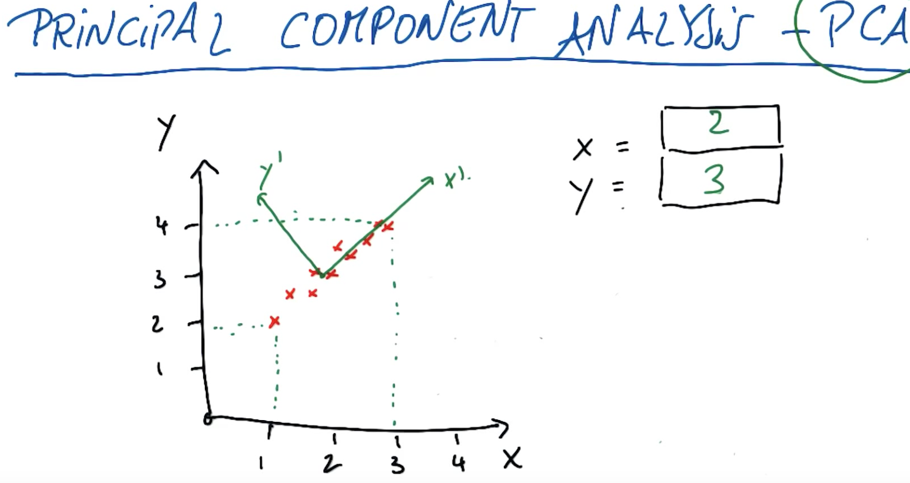
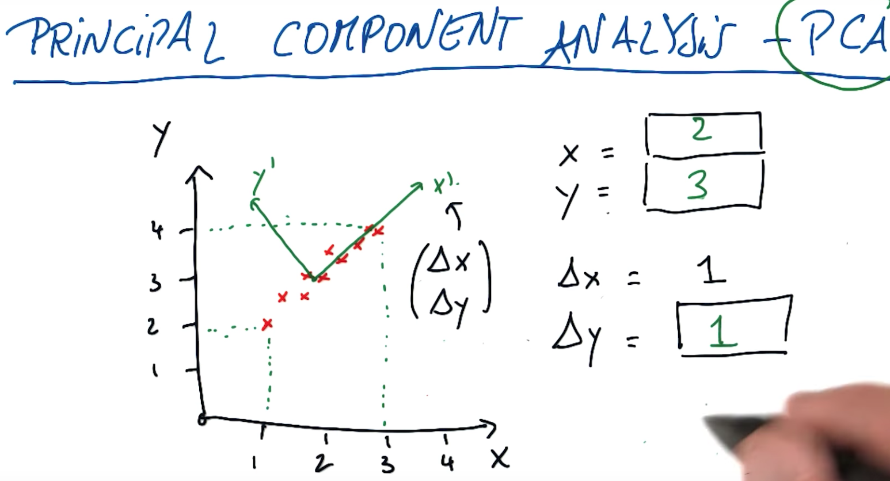
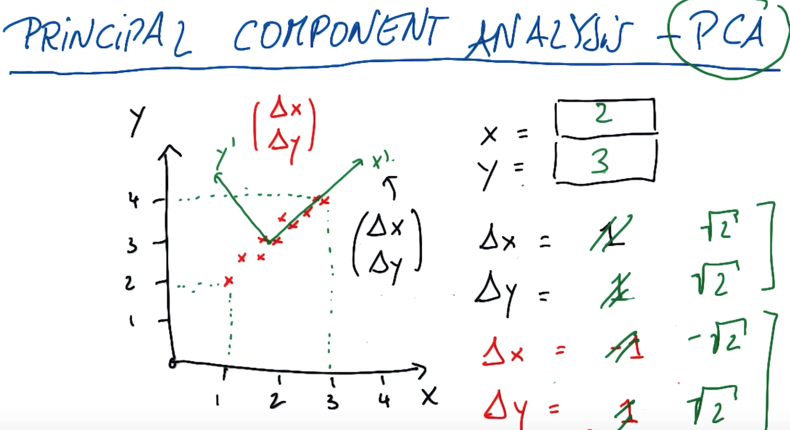
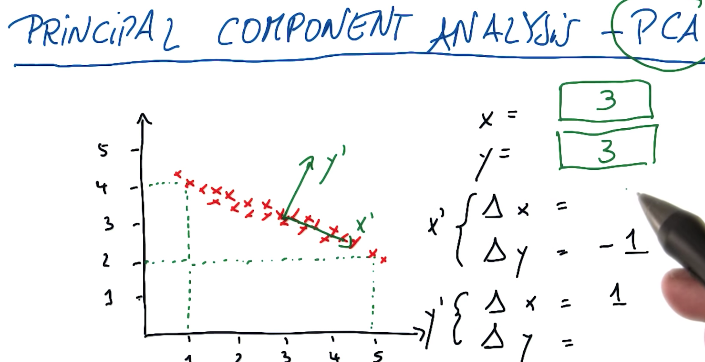
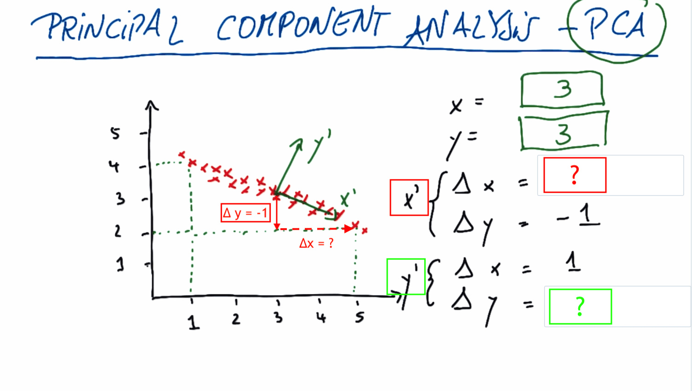
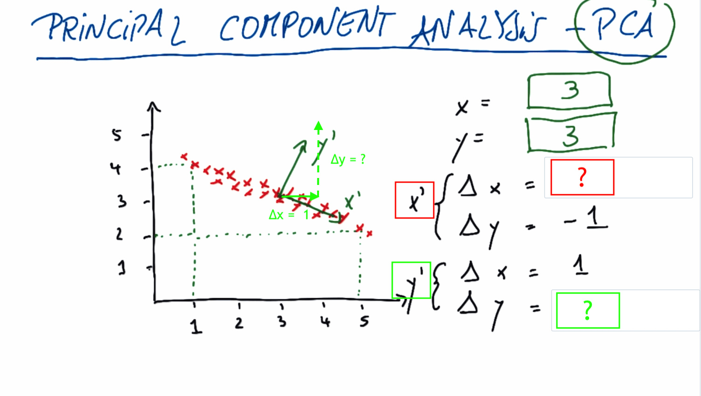
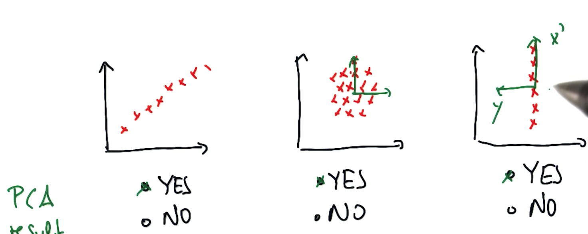
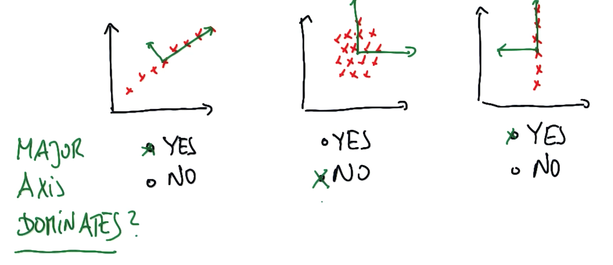
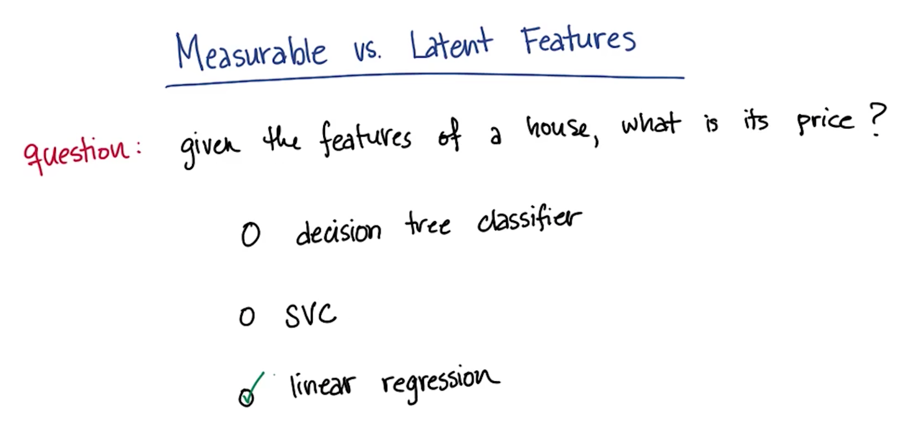
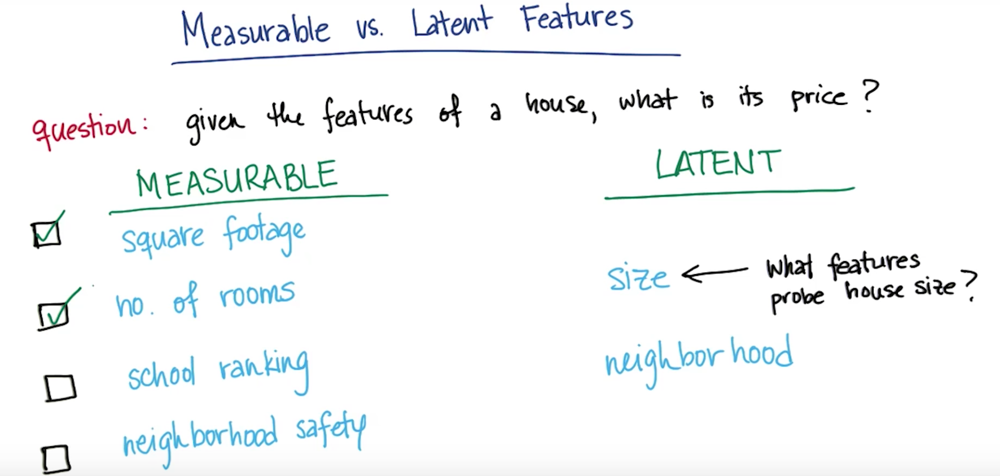

# PCA - Principal Component Analysis
Principal component analysis (PCA) is a statistical procedure that uses an orthogonal transformation to convert a set of observations of possibly correlated variables into a set of values of linearly uncorrelated variables called principal components. 
If you're guven data of any shape, PCA finds a new coordinate system from the old one through translation and rotation only and it moves the centre of the coordinate system. It movesthe x axis into the principal axis of variation (where you see the most variation relative to all the data points) and it moves further axis down the road into an orthogonal less important direction of variation. 
PCA find these axes and also tells you how important these axes are. 

* PCA finds a coordinate syatem that centres itself inside the data and aligns the x axis with the principal axis of variation. 
* In the image below PCA would coordinate the new centre to be at (2,3)

The X' axis is a vector in the old coordinate system which starts at (2,3). 

* Finding Δy given Δx=1 draw a line from the new origin and go across the old x axis by 1 and see what the change in y will be for it (change in old y axis when you draw a line up to the new X' axis). 

* Another e.g. using Y' axis. Find Δx and Δy. There's many different solutions but the best would be for Δx=-1 because we go left and Δy = 1. In reality when we write PCA what you find is lowest output vector is normalised to 1. So when you rescale these vectors you find that for the first one you'll get 1/(SQRT of 2) and so on. The total length will have a length of 1, because the total length is given by the square root of the squares of the sum.  **NOTE: In the image below where there is sqrt of 2 it should be 1/(sqrt 2).** 

* More practice: Find the new origin for the new axes (X' and Y') :

The origin for the new axes will be (3,3)

* Then fill in the Δx and Δy. In both cases, we start from (3,3). The center of the new coordinate system.
For each component, how is a change in the original coordinate system reflected in the new coordinate system?
X' :

Result: Δ y = -1 ⇒ Δ x = 2

Y' :

Result: Δ x = 1 ⇒ Δ y = 2
* Sidenote: If you did the dot product of these two vectors then you would get 0 which is a measure of orthoganality. 
* PCA also returns an importance value, a spread value for these axes. That spread value tends to be very large for the very first axis of variation (X') and much smaller for the second axis of variation (Y') if the spread is small. So this number happens to be an Eigenvalue. It comes out of an Eigenvalue decomposition thst's really implemented by PCA. But what it really gives you is an importance vector, how important to take each axis when you look at the data. So when you run the code you'll find the new origin, you'll find these different vectors and you'll find the importance value if given to these vectors that really measures the amount of spread. 

* Quiz: (i) Does the principal componant analysis return a result for each of the graphs?

The answer is yes in all cases. Part of the beauty of PCA is that the data doesn't have to be perfectly 1D in order to find the principal axis! 
Now, the clear cut case is the left one, which is the one we already discussed. 
But if we have data on a circle (2nd graph) there could still be a main axis and a secondary axis and PCA could give you a deterministic result.
The third one is surprising. When we remember regression, it's impossible to build a regression that goes vertically because you can't really divide this data set here as a fxn y = f(x). But regression treats the variables asymmetrically. One is the input, one is the output. In PCA all we get is vectors. So I can easily imagine a coordinate syste, where the x axis falls vertically, and the y axis goes to the left, and that's the answer for PCA in this case.

* * Quiz: (ii): Does the major axis dominate? By dominate, we mean that the kind of importance value, or the eigenvalue of the major axis is vastly larger than the one of the minor axis. 

First graph: Yes. Once you capture the spread in the dominant direction there isn't much left in the orthogonal direction. 
Second graph: No. The minor axis as spread as the major axis. In fact in this case I would assume that both Eigenvalues are of the same magnitude and we really haven't gained much by running PCA. 
Third graph: Yes. The dominance is really clear here where the major axis really captures all of it and there's really nothing left in the minor axis.

## Intuition for what you do when you use PCA
Q: Which algorithm would you use to find the price of a house given it's features.

This is a classic regression exercise because the output that we expect to get is going to be continuous. So it's not appropriate to use a classifier. We want to use something like a regression that can give us a number as an output, where the number's the price of the house. 
When you're making your regression to determine the price of a house, there's going to be a number of input features that you might potentially be interested in(e.g. square footage, no. of rooms, school ranking, neighbourhood safety). I would argue when you're making these measurements yur really just probing 2 things even though we have 4 features here. You're probing the size of the home and you're asking questions about the neighbourhood. These are 2 examples of latent variables. These are variables that you can't measure directly, but that are sort of driving the phenomenin that you're measuring behind the scenes.

## Compression while preserving information
So now that we know that we have potentially a large number of measurable features, but maybe a small number of underlying latent features that contain most of the information. So what's the best way to condense our features to 2 so that we really get to the heart of the information? So we're really probing size and the neighbourhood. One way to get at this is with just simple feature selection. If you put these 4 features into a feature selection tool, maybe it would keep the square footage, but throw away the number of rooms. Which of the feature selection tools do you think would be most suitable for this? 
SelectPercetile just selects the top X percent where you're allowed to specify the % of features you'd like to keep. SelectKBest - as one of the arguments you specify what k is(the number of features ou want to keep).
Let's get rid of the knowledge we already have 4 features. Let's suppose the number of features you have available to you isn't something that you know very well. But you do know that the size and the neighbourhood are going to be underlying latent variables that are sort of driving the trends in all of the features that you have available to you. So the question is, if you want to have 2 output features, what's the most suitable feature selection tool in this scenario? 

SelectKBest is probably going to be the best answer here, because you know exactly how many you're expecting to get out so it will throw away all of the features except the 2 that are most powerful. SelectPercentile wasn't as good of a choice in this case where we didn't know exactly how many features we had. 
