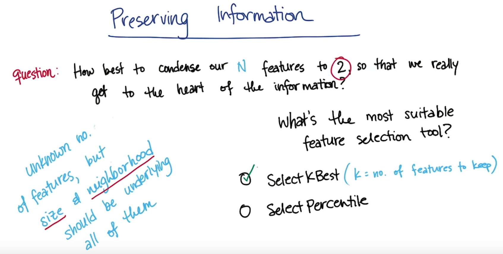
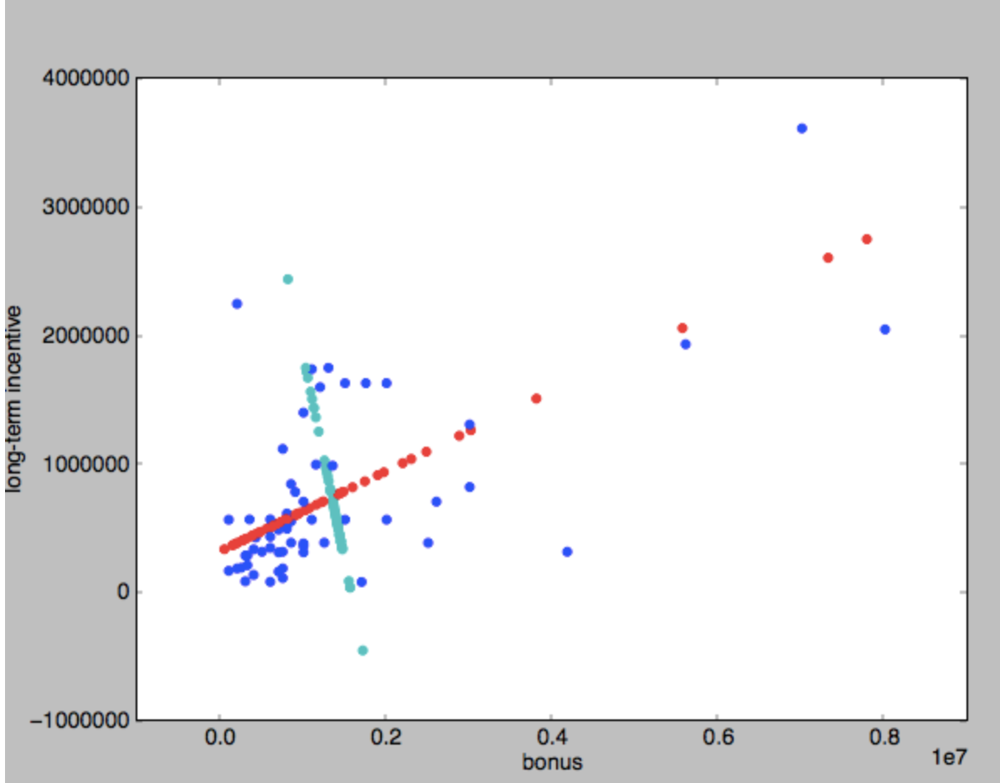

# PCA - Principal Component Analysis
Principal component analysis (PCA) is a statistical procedure that uses an orthogonal transformation to convert a set of observations of possibly correlated variables into a set of values of linearly uncorrelated variables called principal components. 
If you're guven data of any shape, PCA finds a new coordinate system from the old one through translation and rotation only and it moves the centre of the coordinate system. It movesthe x axis into the principal axis of variation (where you see the most variation relative to all the data points) and it moves further axis down the road into an orthogonal less important direction of variation. 
PCA find these axes and also tells you how important these axes are. 

* PCA finds a coordinate syatem that centres itself inside the data and aligns the x axis with the principal axis of variation. 
* In the image below PCA would coordinate the new centre to be at (2,3)

The X' axis is a vector in the old coordinate system which starts at (2,3). 

* Finding Δy given Δx=1 draw a line from the new origin and go across the old x axis by 1 and see what the change in y will be for it (change in old y axis when you draw a line up to the new X' axis). 

* Another e.g. using Y' axis. Find Δx and Δy. There's many different solutions but the best would be for Δx=-1 because we go left and Δy = 1. In reality when we write PCA what you find is lowest output vector is normalised to 1. So when you rescale these vectors you find that for the first one you'll get 1/(SQRT of 2) and so on. The total length will have a length of 1, because the total length is given by the square root of the squares of the sum.  **NOTE: In the image below where there is sqrt of 2 it should be 1/(sqrt 2).** 


* More practice: Find the new origin for the new axes (X' and Y') :

The origin for the new axes will be (3,3)

* Then fill in the Δx and Δy. In both cases, we start from (3,3). The center of the new coordinate system.
For each component, how is a change in the original coordinate system reflected in the new coordinate system?
X' :

Result: Δ y = -1 ⇒ Δ x = 2

Y' :

Result: Δ x = 1 ⇒ Δ y = 2
* Sidenote: If you did the dot product of these two vectors then you would get 0 which is a measure of orthoganality. 
* PCA also returns an importance value, a spread value for these axes. That spread value tends to be very large for the very first axis of variation (X') and much smaller for the second axis of variation (Y') if the spread is small. So this number happens to be an Eigenvalue. It comes out of an Eigenvalue decomposition thst's really implemented by PCA. But what it really gives you is an importance vector, how important to take each axis when you look at the data. So when you run the code you'll find the new origin, you'll find these different vectors and you'll find the importance value if given to these vectors that really measures the amount of spread. 

* Quiz: (i) Does the principal componant analysis return a result for each of the graphs?

The answer is yes in all cases. Part of the beauty of PCA is that the data doesn't have to be perfectly 1D in order to find the principal axis! 
Now, the clear cut case is the left one, which is the one we already discussed. 
But if we have data on a circle (2nd graph) there could still be a main axis and a secondary axis and PCA could give you a deterministic result.
The third one is surprising. When we remember regression, it's impossible to build a regression that goes vertically because you can't really divide this data set here as a fxn y = f(x). But regression treats the variables asymmetrically. One is the input, one is the output. In PCA all we get is vectors. So I can easily imagine a coordinate syste, where the x axis falls vertically, and the y axis goes to the left, and that's the answer for PCA in this case.

* * Quiz: (ii): Does the major axis dominate? By dominate, we mean that the kind of importance value, or the eigenvalue of the major axis is vastly larger than the one of the minor axis. 

First graph: Yes. Once you capture the spread in the dominant direction there isn't much left in the orthogonal direction. 
Second graph: No. The minor axis as spread as the major axis. In fact in this case I would assume that both Eigenvalues are of the same magnitude and we really haven't gained much by running PCA. 
Third graph: Yes. The dominance is really clear here where the major axis really captures all of it and there's really nothing left in the minor axis.

## Intuition for what you do when you use PCA
Q: Which algorithm would you use to find the price of a house given it's features.

This is a classic regression exercise because the output that we expect to get is going to be continuous. So it's not appropriate to use a classifier. We want to use something like a regression that can give us a number as an output, where the number's the price of the house. 
When you're making your regression to determine the price of a house, there's going to be a number of input features that you might potentially be interested in(e.g. square footage, no. of rooms, school ranking, neighbourhood safety). I would argue when you're making these measurements yur really just probing 2 things even though we have 4 features here. You're probing the size of the home and you're asking questions about the neighbourhood. These are 2 examples of latent variables. These are variables that you can't measure directly, but that are sort of driving the phenomenin that you're measuring behind the scenes.


## Compression while preserving information
So now that we know that we have potentially a large number of measurable features, but maybe a small number of underlying latent features that contain most of the information. So what's the best way to condense our features to 2 so that we really get to the heart of the information? So we're really probing size and the neighbourhood. One way to get at this is with just simple feature selection. If you put these 4 features into a feature selection tool, maybe it would keep the square footage, but throw away the number of rooms. Which of the feature selection tools do you think would be most suitable for this? 
SelectPercetile just selects the top X percent where you're allowed to specify the % of features you'd like to keep. SelectKBest - as one of the arguments you specify what k is(the number of features ou want to keep).
Let's get rid of the knowledge we already have 4 features. Let's suppose the number of features you have available to you isn't something that you know very well. But you do know that the size and the neighbourhood are going to be underlying latent variables that are sort of driving the trends in all of the features that you have available to you. So the question is, if you want to have 2 output features, what's the most suitable feature selection tool in this scenario? 

SelectKBest is probably going to be the best answer here, because you know exactly how many you're expecting to get out so it will throw away all of the features except the 2 that are most powerful. SelectPercentile wasn't as good of a choice in this case where we didn't know exactly how many features we had. 

* We have many features available but only a few drive the phenomenons observed. You can use PCA to reduce the dimensionality of your features to turn a whole bunch of features into just a few. It's also a very powrful standalone method in its own right for unsupervised learning. 

Here's an example of what PCA is, transforming from square footage plus number of rooms into a single variable that roughly tracks the size of the house. 
The principal component IS NOT the same as a regression, heres why: With a regression you're trying to predict an output variable with respect to the value of an input variable. Here we're not really trying to predict anything. We're trying to come up with a direction in the data that we can project our data onto while losing a minimal amount of information. 
Here's what that means: Once I've found my principal component (once I have the direction of the vector) then I'm going to take my data points and go through a process of projection. Now instead of being the blue circles, the data is going to be the black X's. I've turned it into a one dimensional disttribution. 


## How to determine the Principal component
We'll use the neighbourhood example in how to determine the principal component. 
In this context when we talk about variance we mean it in the statistical manner (linked to standard deviation). So data with a smaller variance tends to be clustered together tightly. 

In the image below we can draw an oval that roughly contains most of the data. This oval can be parameterised using two numbers: (i) Distance across the narrowest point (ii) Distance across the longest point. 
When we project along the direction of largest variance this retains the maximum amount of information in the original data. 


Now let's look at the neighbourhood info for our housing data. When I project down the 2D points onto the 1D line I'm going to be loosing information. The amount of information I loose is equal to the distance between a given point, as it existed in the 2D space, and it's new spot on the line.

The information loss will be the sum of the distances between each of the points in 2D space and their new projected spots on the line. During PCA we want to make sure this sum is as a small as possible so we don't loose much information. 
 

## PCA for feature transformation
We can put all 4 of the features into PCA together, and it can automatocally combine them into new features and rank the relative powers of those new features. So if we ahve the case where we have two latent features that are driving most of the variation in the data, PCA will pick these out and it will call them the first and second proncipal components. Where the first principal component os the one that has the most effect. It's a little bit harder to make these interpretations now because what can and does happen is that the first principal component will be an admixture that has little bits and pieces from potentially all of the features. This is a very powerfull unsupervised learning technique that you can use to fundamentally understand the latent features in your data. 


* The max number of PCs is min(n_features, n_data_points).


## Review/definition of PCA


## Applying PCA to the Enron data
```{python}
from sklearn.decomposition import PCA
def doPCA():
  X = np.array([[-1, -1], [-2, -1], [-3, -2], [1, 1], [2, 1], [3, 2]])
  pca = PCA(n_components=2)
  pca.fit(X)
  return pca
  
pca = doPCA()
# By printing this line we find out that the first principal component has about 90% of the variation in the data, and the second one has about 10%. 
print pca.explained_variance_ratio_ # The Eigenvalues
#The components is going to be a list, that has as many principal components in it as I asked for as a parameter in doPCA()
first_pc = pca.components_[0]
second_pc = pca.components_[1]

#Once I've fit my PCA I have to perform a transformation of the data
transformed_data = pca.transform(data)
#This code will plot the principal component and the location of all the points along that principalcompoent, as well as the dircetion of the principal component(which is accessed through the information in the elements of the PC vector. . 
for ii, jj in zip(transformed_data, data):
  plt.scatter(first_pc[0]*ii[0], first_pc[1]*ii[0], color="r")
  plt.scatter(second_pc[0]*ii[1], second_pc[1]*ii[1], color="c")
  #In blue we have the original data
  plt.scatter(jj[0], jj[1], color="b")
plt.xlabel("bonus")
plt.ylabel("long term bonus")
plt.show()
```



## When to use PCA
1. When you want access to latent features that you think might be showing up in the patterns in your data. Maybe the entire point of what you're trying to do is figure out if there's a latent feature. In other words you just want to know the size of the first principal component. an example of this might be something like can you measure who the big shots are at Enron.
2. Dimensionality reduction. There's a number of things PCA can do to help you on this front. 
  (i) Can help you visualise high dimensional data. when you're drawing a csatterplot you only have two dimensions available., but many times you'll have more than two features. So you can project it down to the first two principal componentsand just plot that. Then things like k means clustering might be a lot easier for you to visualise. You're still capturing most of the information in the data but now you can draw it in 2D.
  (ii) Reduce noise. The hope is that the first and second principal component are capturing the actual patterns in the data and the smaller principal components are just representing noisy variation about those patterns. So by throwing w=away the less important principal components, you're getting rid of that noise. 
  (iii) Using PCA as pre processing before you use another algorithm. If you have very high dimensionality, and if you have a complex classification algorithm, the algorithm can ve very high variance, it can end up fitting to noise in the data. It can ed up running really slow. There are lots of things that can happen when you have very high input dimensionality with tese algorithms. So you can use PCA to reduce the dimensionality of your input features so that your calssification algorithm works better.   


## PCA for facial recognition


## Mini Project - eigenfaces
Our discussion of PCA spent a lot of time on theoretical issues, so in this mini-project we’ll ask you to play around with some sklearn code. The eigenfaces code is interesting and rich enough to serve as the testbed for this entire mini-project.

The starter code can be found in pca/eigenfaces.py. This was mostly taken from the example on the sklearn documentation.

* We mentioned that PCA will order the principal components, with the first PC giving the direction of maximal variance, second PC has second-largest variance, and so on. How much of the variance is explained by the first principal component? The second?
```{python}
# FIND VARIANCE EXPLAINED BY FIRST AND SECOND PRINCIPAL COMPONENTS
print "\npca.explained_variance_ratio_"
print pca.explained_variance_ratio_
print "\npca.explained_variance_"
print pca.explained_variance_
```

=> Amount of variance explained y the first principal component: 0.19
=> Amount of variance explained y the second principal component: 0.15

* Now you'll experiment with keeping different numbers of principal components. In a multiclass classification problem like this one (more than 2 labels to apply), accuracy is a less-intuitive metric than in the 2-class case. Instead, a popular metric is the F1 score.
We’ll learn about the F1 score properly in the lesson on evaluation metrics, but you’ll figure out for yourself whether a good classifier is characterized by a high or low F1 score. You’ll do this by varying the number of principal components and watching how the F1 score changes in response.
As you add more principal components as features for training your classifier, do you expect it to get better or worse performance?
=> Ideally, we hope that adding more components will give us more signal information to improve the classifier performance.

* Change n_components to the following values: [10, 15, 25, 50, 100, 250]. For each number of principal components, note the F1 score for Ariel Sharon. (For 10 PCs, the plotting functions in the code will break, but you should be able to see the F1 scores.) If you see a higher F1 score, does it mean the classifier is doing better, or worse?
|n_components|F1 score for Ariel Sharon|
|------------|-------------------------|
| 10 | 0.11 |
| 15 | 0.33 |
| 25 | 0.62 |
| 50 | 0.67 |
| 100 | 0.67 |

=> It seems the higher the F1 value, the better the fitting is. 

* Do you see any evidence of overfitting when using a large number of PCs? Does the dimensionality reduction of PCA seem to be helping your performance here?
=> Yes, performance starts to drop with too many PCs. You can see the F1 score starts to drop.

## How to select the number of PCs you should look at
There's no cut and dry way of deciding how many PCs to use. You should train on different umber of PCs, and see how accuracy responds - cut off when it becomes apparent that adding more PCS doesn't buy you much more discrimination.