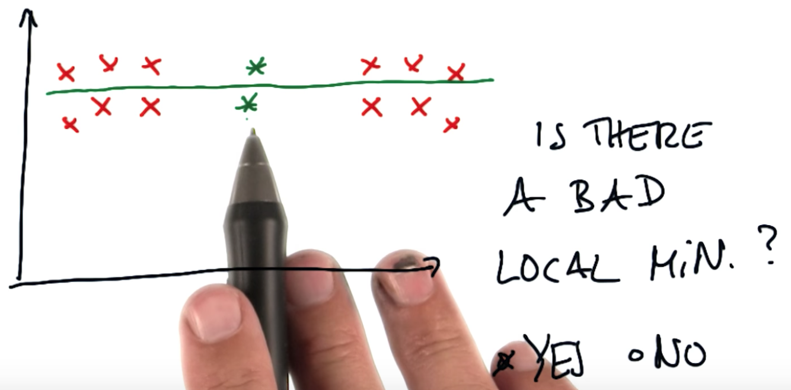
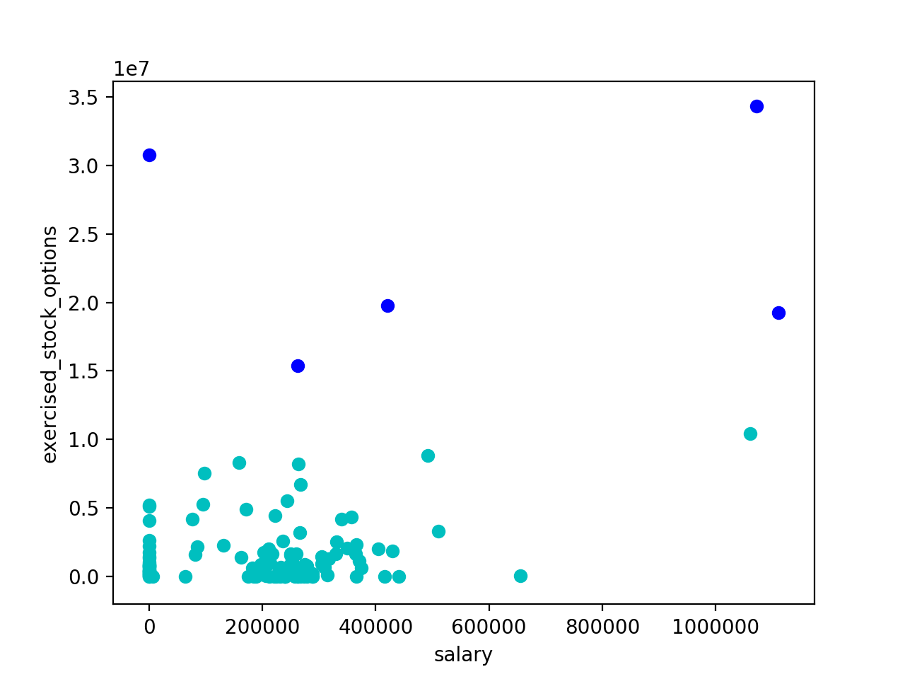
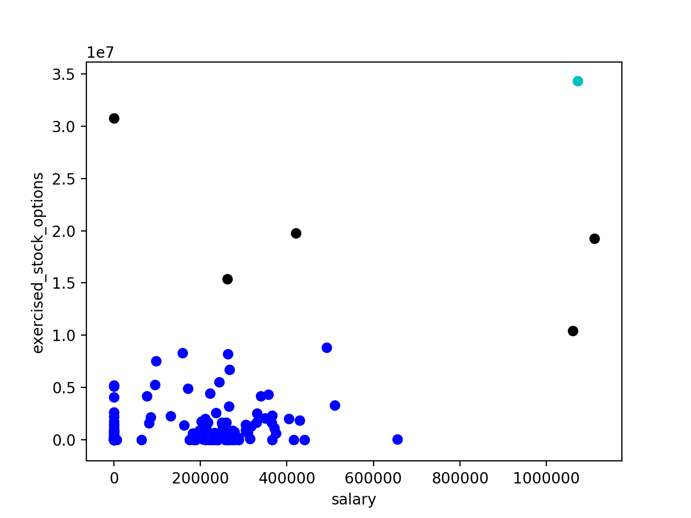
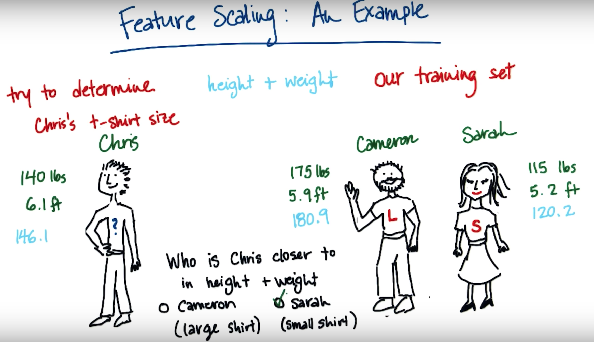
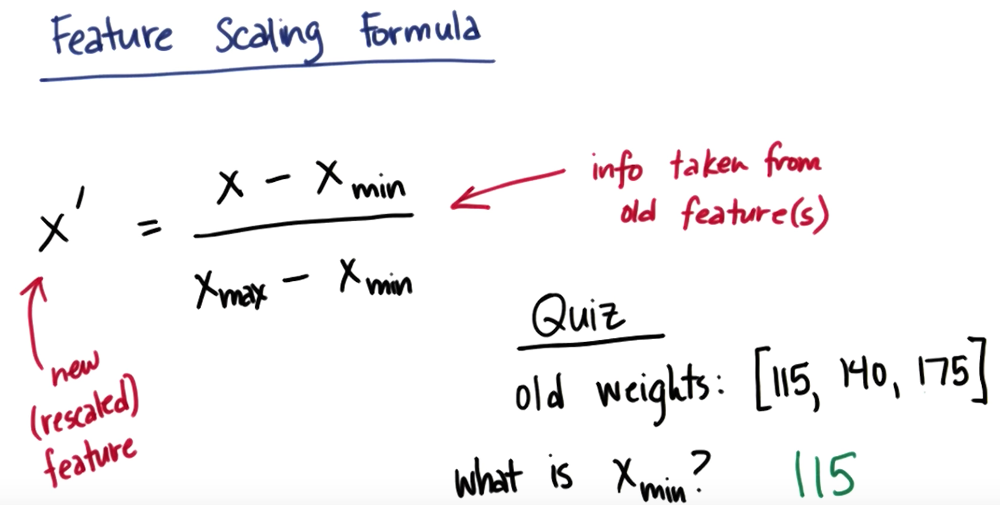
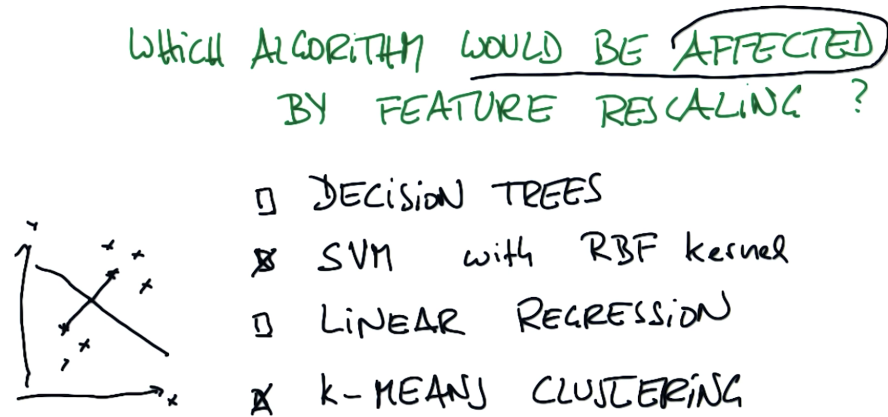
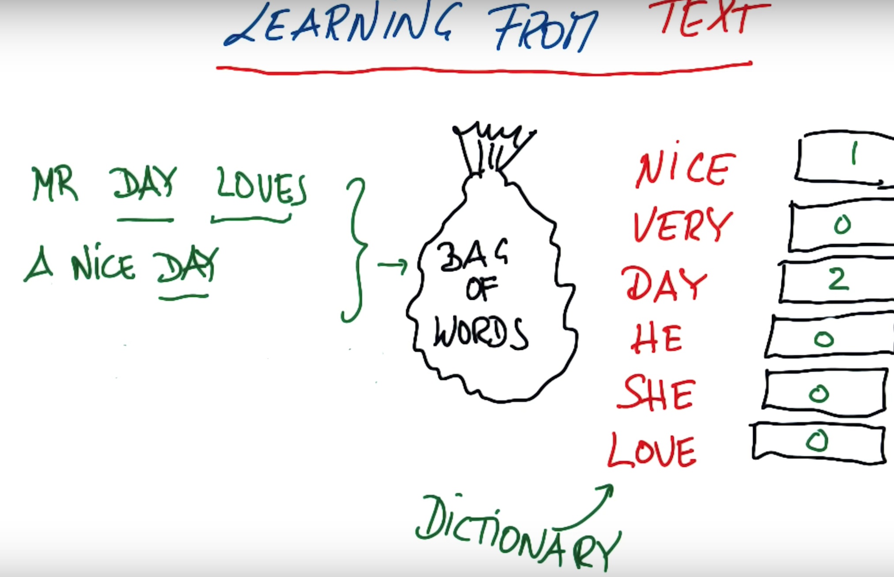
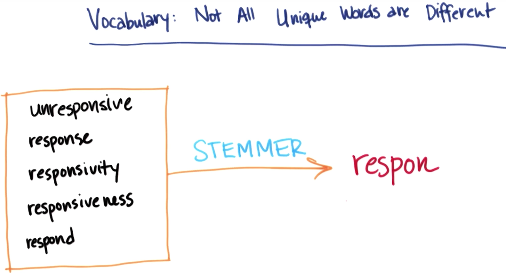

# Clustering
Unsupervised learning is a type of machine learning algorithm used to draw inferences from datasets consisting of input data without labeled responses.

The most common unsupervised learning method is cluster analysis, which is used for exploratory data analysis to find hidden patterns or grouping in data. The clusters are modeled using a measure of similarity which is defined upon metrics such as Euclidean or probabilistic distance.

* K means works in teo steps: 
  (i) Assign - Assign cluster centres.
  (ii) Optimise - Minimise the total quardratic distance of a cluster centre to the points.
  
## K means clustering parameters with sklearn:
* n_clusters: default value is 8but you need to set in on your own based on what makes sense. This might even be a paarmeter that you play around with.  
* maz_iter = 300 parameter: Rememeber we have an iteration that we go through as we're finding the clusters, where we assign each point to a centroid and then we move the centroid. 300 iterations of this process will usually be a very reasonable number but you may want to change it.
* n_init: K means clustering has this challenge that depending on what the initial conditions are you can sometimes end up with different clusterings. So you want to repeat the algoritm several times to make sure that in general the ensemble of all the clusterings will give you something that makes sense. This parameter controls how many times it initialises the program and come up with clusters

## Limitations of K means clustering
* Given a fixed data set and a fixed number of cluster centres when you run k means you **wont** always arrive at the same result. ]
* K mean could end up finding a local minimum rather than a global minimum. It depends on the initialisations of your cluster centres. K means is a local hill climbing algorithm. As a rule of thumb- the more cluster centres you have, the more local minimums you will end up finding so you must run the algorithm several times to be sure of obtaining the global minimum.


## Mini project
In this project, we’ll apply k-means clustering to our Enron financial data. Our final goal, of course, is to identify persons of interest; since we have labeled data, this is not a question that particularly calls for an unsupervised approach like k-means clustering.
Nonetheless, you’ll get some hands-on practice with k-means in this project, and play around with feature scaling, which will give you a sneak preview of the next lesson’s material.

* The starter code can be found in k_means/k_means_cluster.py, which reads in the email + financial (E+F) dataset and gets us ready for clustering. You’ll start with performing k-means based on just two financial features--take a look at the code, and determine which features the code uses for clustering. 
=> Salary and exercised_stock_options

* Deploy k-means clustering on the financial_features data, with 2 clusters specified as a parameter. Store your cluster predictions to a list called pred, so that the Draw() command at the bottom of the script works properly. In the scatterplot that pops up, are the clusters what you expected?
```{python}
from sklearn.cluster import KMeans
clf = KMeans(n_clusters=2).fit(finance_features)
pred = clf.predict(finance_features)
```


* Add a third feature to features_list, “total_payments". Now rerun clustering, using 3 input features instead of 2 (obviously we can still only visualize the original 2 dimensions). Compare the plot with the clusterings to the one you obtained with 2 input features. Do any points switch clusters? How many? This new clustering, using 3 features, couldn’t have been guessed by eye--it was the k-means algorithm that identified it.


* In the next lesson, we’ll talk about feature scaling. It’s a type of feature preprocessing that you should perform before some classification and regression tasks. Here’s a sneak preview that should call your attention to the general outline of what feature scaling does.
What are the maximum and minimum values taken by the “exercised_stock_options” feature used in this example?
(NB: if you look at finance_features, there are some "NaN" values that have been cleaned away and replaced with zeroes--so while those might look like the minima, it's a bit deceptive because they're more like points for which we don't have information, and just have to put in a number. So for this question, go back to data_dict and look for the maximum and minimum numbers that show up there, ignoring all the "NaN" entries.)
```{python}
eso = numpy.array(finance_features)[:, 1]
eso = eso[eso>0]
print ('MAX: {}, MIN: {}'.format(numpy.max(eso), numpy.min(eso)))
```

***

# Feature Scaling

If a computer tried to figure out what shirt size Chris should wear by adding the height+weight of Chris and assigning him the same size as the person with the closest number for height+weight it would say he should have a size small. However, our intuition would be that he should have a large as Cameron is also quite tall and although a bit heavier a Large would probably fit Chris a lot better than a small.

What went wrong is that this metric of height+weight has two very imbalanced features as weight takes on much larger values so it will almost always completely dominate the metric. We need to rescale these features so that they always span comparable ranges, usually between 0 and 1. 

## Feature scaling formula:

Having the new X' be a value between 0 and 1 has some benefits and downsides. Benefit: You have a very reliable number as to what you can expect in the output. Disadvantage: if you have outliers in your input features then they cankind of mess up your rescaling. 

* Write a function that performs feature scaling:
```{python}
def featureScaling(arr):
    x_min = min(arr)
    x_max = max(arr)
    max_minus_min = float(x_max - x_min)
    rescaled_arr = []
    i=0
    while i< len(arr):
        new_x = (arr[i] - x_min)/max_minus_min
        rescaled_arr.append(new_x)
        i+=1
    return rescaled_arr
```

## Min/Max scaler in Sklearn
*Remember to import NumPy as Sklearn uses NumPy arrays*
Each element of the NumPy array is going to be a different training point, and then each element within that training point is going to be a feature.
Note: the input is expecting floating point numbers so if you have ints then turn them into floating point numbers by adding a decimal point to them. 
```{python}
from sklearn.preprocessing import MinMaxScaler
import numpy
data = numpy.array([[-1, 2], [-0.5, 6], [0, 10], [1, 18]])
scaler = MinMaxScaler()
rescaled_data = scaler.fit(data)
```

## which algorithms are affected by rescaling?
Algorithms in which two dimensions affect the  outcome will be affected by rescaling.
* K-Means Clustering and SVM requires making trade-offs in dimensions when you calculate the distance. 
* SVM - You look at the seperation line that maximises distance. That distance calculation trade offs one dimension against another.The same is true for K means clustering, where you have a cluster centre and you compute the distance from the cluster centre to all of the data points. 

No affect on decision tress and linear regression:
* Decision Trees use vertical and horizontal lines so there is no trade off. You just make a cut in one direction and then a cut in another. So you don't have to worry about what's going on in one dimension when you're doing something with the other one.  
* In linear regression each of our features is going to have a ciefficient that's associated with it. And that coefficient and feature always go together. What's going on with feature A doesn't effect anything with the coefficient of feature B. 

## Mini project
In the last project, you performed k-means clustering on the Enron characters using their financial data as inputs. We’ll update that work to include scaled features, to see how that changes things.
Look back to the last part of the K-Means Clustering Mini-Project. We deployed scaling there without going into the details of the scaling algorithm, but now you know much more about specific scaling algorithms and can diagnose what kind of scaling we were using.
What type of scaling was deployed?
=> MinMaxScaler

* Apply feature scaling to your k-means clustering code from the last lesson, on the “salary” and “exercised_stock_options” features (use only these two features). What would be the rescaled value of a "salary" feature that had an original value of $200,000, and an "exercised_stock_options" feature of $1 million? (Be sure to represent these numbers as floats, not integers!)
```{python}
feature_1 = "salary"
feature_2 = "exercised_stock_options"
poi = "poi"
features_list = [poi, feature_1, feature_2]
data = featureFormat(data_dict, features_list)
poi, finance_features = targetFeatureSplit(data)

from sklearn.preprocessing import MinMaxScaler
scaler = MinMaxScaler()
print(scaler.fit(finance_features))
print(scaler.data_max_)

finance_features_test = numpy.array([[200000., 1000000.]])
print(scaler.transform(finance_features_test))
```

* One could argue about whether rescaling the financial data is strictly necessary, perhaps we want to keep the information that a $100,000 salary and $40,000,000 in stock options are dramatically different quantities. What if we wanted to cluster based on “from_messages” (the number of email messages sent from a particular email account) and “salary”? Would feature scaling be unnecessary in this case, or critical?
=> It would be critical. Emails typically number in the hundreds or low thousands, salaries are usually at least 1000x higher.

***
# Text Learning
**Bag of words technique:** 
* Take any text and count the frequency of words. Map each phrase from email into a frequency count defined over a dictionary of words that you're interested in. 
* Word order doesn't matter.
* Can't handle complex phrases like "Chicago Bulls" (Which is a sports team).
* Long phrases give different input vectors. By some extent you're biasing yourself to also encode the length of your text not just the frequency of words. 


## Bag of words (aka count vectorizer) in Sklearn
Convert a collection of text documents to a matrix of token counts.
Text Analysis is a major application field for machine learning algorithms. However the raw data, a sequence of symbols cannot be fed directly to the algorithms themselves as most of them expect numerical feature vectors with a fixed size rather than the raw text documents with variable length.
In order to address this, scikit-learn provides utilities for the most common ways to extract numerical features from text content, namely:
* tokenizing strings and giving an integer id for each possible token, for instance by using white-spaces and punctuation as token separators.
* counting the occurrences of tokens in each document.
* normalizing and weighting with diminishing importance tokens that occur in the majority of samples / documents.
```{python}
from sklearn.feature_extraction.text import CountVectorizer

vectorizer = CountVectorizer()
#lets make some sample strings
string1= 'This is the first document.'
string2='This is the second second document.'
string3='And the third one.'
string4='Is this the first document?'
#In order to use these strings with countCextorizer they need to be inside a list
email_list=[string1, string2, string3, string4]
#fit the data
bag_of_words = vectorizer.fit(email_list)
#Transform the data - takes all the words in the corpus and figures out the count of each of the words
bag_of_words = vectorizer.transform(email_list)
print(bag_of_words)
#Take a row from printing the bag of words. Say, for e.g. got a row that says "(1,7) 1". This means that in document number 1 (which is string 2 due to 0 index) the 7th word occurred 1 time. 
# In this sklearn docs we can see there's an attribute "vocabulary" that tells you the feature number for a specified word.
print vectorizer.vocabulary_.get("second")
```

### When it comes to vocabulary not all word are equal.
* Some words contain more info than others. Words such as "hi", "the", "will" and "of" won't tell you a lot about what's going on in an meail. 
* We can remove these less important words from the corpus so that we dont generate noise with these words. These words are known as "stopwords". It's common to remove stopwords during a pre processing analysis. 

## How to get Stopwirds out of pythin package NLTK
In the terminal:
```{python}
#Use the python interpreter
python
#To get the stopword out we have to import them from NLTK
from nltk.corpus import stopwords
#To get a list of stopwords (Need to add language you want in the parameters):
sw = stopwords.words("english") 
#We can go into the sw list and see what some of the stopwords are
sw[0]
```

### Not all unique words are different
Say in my corpus I have a veriety of versions of the word respond(unresponsive, response, responsivity, responsiveness), where the meaning changes ever so slightly based on context but they're all basically talking about the same idea. If I naively put these into a bag of wors they're all going to show up as different features, even though the're all getting at roughly the same idea.  
Lunkily there's a way of bundling these all up together and representing them as a single word, and the way that that happens is using an algorithm called a stemmer. The temmer woulsd apply a function to these words and then strip them down all until they have the same root. 


### Stemming with NLTK
```{python}
#Fire up Python interpreter
python
from nltk.stem.snowball import SnowballStemmer
#create the stemmer and pass in the language you're using
stemmer = SnowballStemmer("english")
#Let's try a word from the "responsive" example 
stemmer.stem("responsiveness")
#returns "respons"
```

## TfIdf representation - weighting by term frequency
* Tf - term frequency (similar to bag of words)
* Idf - inverse document frequency (weighted by how often word occurs in corpus, i.e. in all of the documents put together)
* A TfIdf rates the rare words more highly then the common words. This is because the rare words will help you distinguish different messages from each other. 

## Mini project
In the beginning of this class, you identified emails by their authors using a number of supervised classification algorithms. In those projects, we handled the preprocessing for you, transforming the input emails into a TfIdf so they could be fed into the algorithms. Now you will construct your own version of that preprocessing step, so that you are going directly from raw data to processed features.

You will be given two text files: one contains the locations of all the emails from Sara, the other has emails from Chris. You will also have access to the parseOutText() function, which accepts an opened email as an argument and returns a string containing all the (stemmed) words in the email.

* You’ll start with a warmup exercise to get acquainted with parseOutText(). Go to the tools directory and run parse_out_email_text.py, which contains parseOutText() and a test email to run this function over.
parseOutText() takes the opened email and returns only the text part, stripping away any metadata that may occur at the beginning of the email, so what's left is the text of the message. 

* In parseOutText(), comment out the following line: 

words = text_string

Augment parseOutText() so that the string it returns has all the words stemmed using a SnowballStemmer (use the nltk package). Rerun parse_out_email_text.py, which will use your updated parseOutText() function--what’s your output now?
Hint: you'll need to break the string down into individual words, stem each word, then recombine all the words into one string.
```{python}
from nltk.stem.snowball import SnowballStemmer
stemmer = SnowballStemmer("english")
stemmed_words = [stemmer.stem(token) for token in text_string.split()]
words = ' '.join(stemmed_words)
```

* In vectorize_text.py, you will iterate through all the emails from Chris and from Sara. For each email, feed the opened email to parseOutText() and return the stemmed text string. Then do two things:
1. Remove signature words (“sara”, “shackleton”, “chris”, “germani”--bonus points if you can figure out why it's "germani" and not "germany")
2. Append the updated text string to word_data -- if the email is from Sara, append 0 (zero) to from_data, or append a 1 if Chris wrote the email.

Once this step is complete, you should have two lists: one contains the stemmed text of each email, and the second should contain the labels that encode (via a 0 or 1) who the author of that email is.
Running over all the emails can take a little while (5 minutes or more), so we've added a temp_counter to cut things off after the first 200 emails. Of course, once everything is working, you'd want to run over the full dataset.
```{python}
### use parseOutText to extract the text from the opened email
text = parseOutText(email)

### use str.replace() to remove any instances of the words
words_to_remove = ["sara", "shackleton", "chris", "germani"]
for word in words_to_remove:
   text = text.replace(word, '')
### append the text to word_data
word_data.append(text)
### append a 0 to from_data if email is from Sara, and 1 if email is from Chris
if name == "sara":
  from_data.append(0)
else:
   from_data.append(1)

            email.close()
```

* Transform the word_data into a tf-idf matrix using the sklearn TfIdf transformation. Remove english stopwords.
You can access the mapping between words and feature numbers using get_feature_names(), which returns a list of all the words in the vocabulary. How many different words are there?
```{python}
#Transform the word_data into a tf-idf matrix using the sklearn TfIdf transformation.
#Remove english stopwords
from sklearn.feature_extraction.text import TfidfVectorizer

vectorizer = TfidfVectorizer(stop_words="english", lowercase=True)
vectorizer.fit_transform(word_data)
feature_names = vectorizer.get_feature_names()

print 'Number of different words: {0}'.format(len(feature_names))
```

***

