# Validation
Why use training and testing data?
* Serves as a check for overfitting
* Gives estimate of performance on an indpeendent dataset

## Train/Test in sklearn
We'll use a group of functions that fall under the title "Cross validation". Learning the parameters of a prediction function and testing it on the same data is a methodological mistake: a model that would just repeat the labels of the samples that it has just seen would have a perfect score but would fail to predict anything useful on yet-unseen data. This situation is called overfitting. To avoid it, it is common practice when performing a (supervised) machine learning experiment to hold out part of the available data as a test set.

In scikit-learn a random split into training and test sets can be quickly computed with the train_test_split helper function. Let’s load the iris data set to fit a linear support vector machine on it:
We can quickly sample a training set while holding out 40% of the data for testing (evaluating) our classifier:
```{python}
from sklearn import datasets
from sklearn.svm import SVC
from sklearn.model_selection import train_test_split

iris = datasets.load_iris()
features = iris.data
labels = iris.target

features_train, features_test, labels_train, labels_test = train_test_split(
...     iris.data, iris.target, test_size=0.4, random_state=0)


#train svm on training data
clf = SVC(kernel="linear", C=1.)
clf.fit(features_train, labels_train)

print clf.score(features_test, labels_test)
```

## Where to use training vs. testing
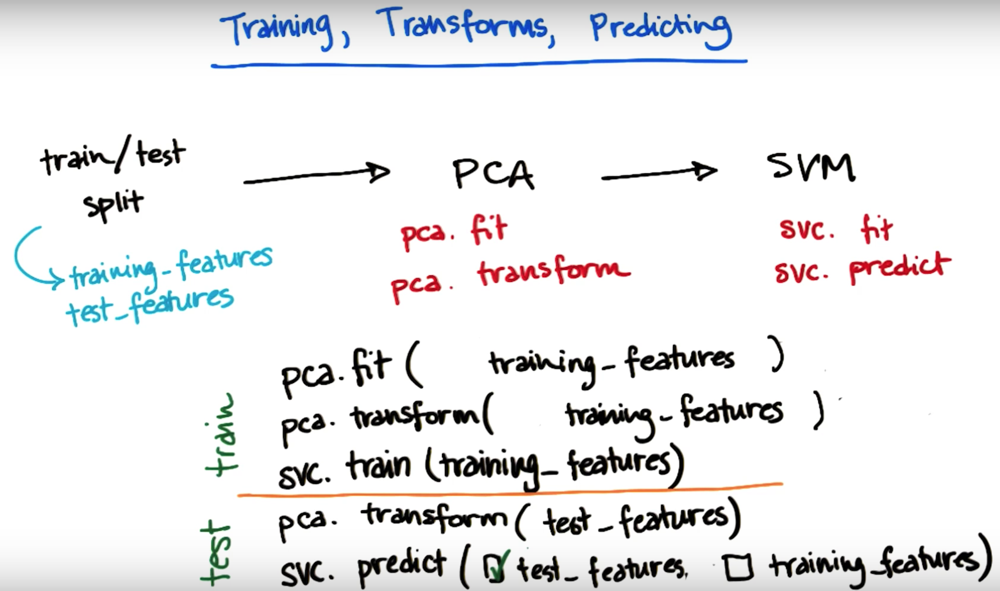

## K fold cross validation
There's a tradeoff with splitting your data for testing and training. We want as much data as possible for training our algorithm, but at the same tine we need plenty of data for validating our algorithm.
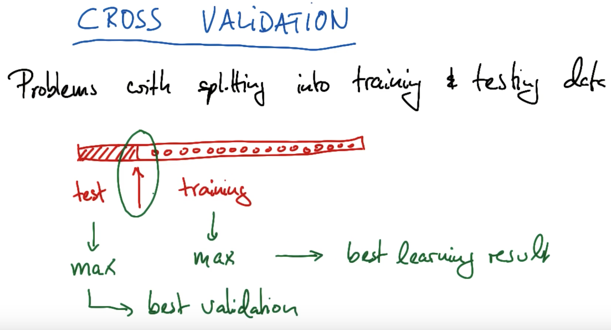
With cross validation you partition your dataset into k bins of equal size. For eg, if we have a datset with 200 points and 10 bins, each bin would have 20 data points. 
In k fold cross validation you run k seperate learning experiments. In each of those, you pick one of those k subsets as your testing set. The remaining k-1 bins are put together into the training set, then you train your machine learning algorithm and test the performance on the testing set. The key thing in cross validation is you run this multiple times. In thi case 10 times, and then you average the 10 different testing set performances for the 10 different hold out sets, so you average the test results from those k experiments. 
Obviously, this takes more computing time because you now have to run  k seperate learning experiments, but theassesment of the learning algorithm would be more accurate. So if your concern is to have minimum training time then you would do the traditional test/train procedure. 

## K fold in sklearn
Provides train/test indices to split data in train/test sets. Split dataset into k consecutive folds (without shuffling by default). Each fold is then used once as a validation while the k - 1 remaining folds form the training set.

If our original data comes in some sort of sorted fashion, then we will want to first shuffle the order of the data points before splitting them up into folds, or otherwise randomly assign data points to each fold. If we want to do this using KFold(), then we can add the "shuffle = True" parameter when setting up the cross-validation object.

```{python}
>>> from sklearn.model_selection import KFold
>>> X = np.array([[1, 2], [3, 4], [1, 2], [3, 4]])
>>> y = np.array([1, 2, 3, 4])
>>> kf = KFold(n_splits=2)
>>> kf.get_n_splits(X)
2
>>> print(kf)  
KFold(n_splits=2, random_state=None, shuffle=False)
>>> for train_index, test_index in kf.split(X):
...    print("TRAIN:", train_index, "TEST:", test_index)
...    X_train, X_test = X[train_index], X[test_index]
...    y_train, y_test = y[train_index], y[test_index]
TRAIN: [2 3] TEST: [0 1]
TRAIN: [0 1] TEST: [2 3]
```

If we have concerns about class imbalance, then we can use the StratifiedKFold() class instead. Where KFold() assigns points to folds without attention to output class, StratifiedKFold() assigns data points to folds so that each fold has approximately the same number of data points of each output class. This is most useful for when we have imbalanced numbers of data points in your outcome classes (e.g. one is rare compared to the others). For this class as well, we can use "shuffle = True" to shuffle the data points' order before splitting into folds.

## Cross validation for parameter tuning
### GridSearch in sklearn
GridSearchCV is a way of systematically working through multiple combinations of parameter tunes, cross-validating as it goes to determine which tune gives the best performance. The beauty is that it can work through many combinations in only a couple extra lines of code.
Here's an example from the sklearn documentation:
```{python}
parameters = {'kernel':('linear', 'rbf'), 'C':[1, 10]}
svr = svm.SVC()
clf = grid_search.GridSearchCV(svr, parameters)
clf.fit(iris.data, iris.target)
```
Let's break this down line by line.
```{python}
parameters = {'kernel':('linear', 'rbf'), 'C':[1, 10]} 
```
A dictionary of the parameters, and the possible values they may take. In this case, they're playing around with the kernel (possible choices are 'linear' and 'rbf'), and C (possible choices are 1 and 10).

Then a 'grid' of all the following combinations of values for (kernel, C) are automatically generated:
|('rbf', 1) | ('rbf', 10)|
|('linear', 1) |('linear', 10) |
Each is used to train an SVM, and the performance is then assessed using cross-validation.
```{python}
svr = svm.SVC()
```
This looks kind of like creating a classifier, just like we've been doing since the first lesson. But note that the "clf" isn't made until the next line--this is just saying what kind of algorithm to use. Another way to think about this is that the "classifier" isn't just the algorithm in this case, it's algorithm plus parameter values. Note that there's no monkeying around with the kernel or C; all that is handled in the next line.
```{python}
clf = grid_search.GridSearchCV(svr, parameters)
```
This is where the first bit of magic happens; the classifier is being created. We pass the algorithm (svr) and the dictionary of parameters to try (parameters) and it generates a grid of parameter combinations to try.
```{python}
clf.fit(iris.data, iris.target)
```
And the second bit of magic. The fit function now tries all the parameter combinations, and returns a fitted classifier that's automatically tuned to the optimal parameter combination. You can now access the parameter values via 
```{python}
clf.best_params_
```


## Mini project
In this mini-project, you’ll start from scratch in making a training-testing split in the data. This will be the first step toward your final project, of building a POI identifier.

* You’ll start by building the simplest imaginable (unvalidated) POI identifier. The starter code (validation/validate_poi.py) for this lesson is pretty bare--all it does is read in the data, and format it into lists of labels and features. Create a decision tree classifier (just use the default parameters), train it on all the data (you will fix this in the next part!), and print out the accuracy. THIS IS AN OVERFIT TREE, DO NOT TRUST THIS NUMBER! Nonetheless, what’s the accuracy?
```{python}
import pickle
import sys
sys.path.append("../tools/")
from feature_format import featureFormat, targetFeatureSplit
from sklearn import tree
import numpy as np
from sklearn.metrics import accuracy_score
from sklearn import cross_validation
data_dict = pickle.load(open("../final_project/final_project_dataset.pkl", "r") )

### first element is our labels, any added elements are predictor
### features. Keep this the same for the mini-project, but you'll
### have a different feature list when you do the final project.
features_list = ["poi", "salary"]

data = featureFormat(data_dict, features_list)
labels, features = targetFeatureSplit(data)
features_train, features_test, labels_train, labels_test = cross_validation.train_test_split(features, labels, test_size=0.3, random_state=42)

from sklearn import tree
from sklearn.metrics import accuracy_score

clf = tree.DecisionTreeClassifier()

clf = clf.fit(features_train, labels_train)
pred = clf.predict(features_test)
accuracy = accuracy_score(pred, labels_test)
print accuracy

clf_all = clf.fit(features, labels)
pred2 = clf_all.predict(features)
accuracy2 = accuracy_score(pred2, labels)
print accuracy2
```
=> The overfit data has an accuracy of 0.99

* Now you’ll add in training and testing, so that you get a trustworthy accuracy number. Use the train_test_split validation available in sklearn.cross_validation; hold out 30% of the data for testing and set the random_state parameter to 42 (random_state controls which points go into the training set and which are used for testing; setting it to 42 means we know exactly which events are in which set, and can check the results you get). What’s your updated accuracy?
=>(Answer also in code above. Now have an accuracy of 0.72)

***

# Evaluation metrics
Use evaluation metrics to tell if our algorithm is improving and how it's performing overall. 
 accuracy = (no. of all data points labeled correctly)/(all data points)
Some of the shortcomings for accuracy in terms of identofying POI with our Enron data include:
* Not ideal for skewed classes
* May want to err on side of guessing innocent (so we dont incrimate innocent people)
* May want to err on side of guessing guilty (so they can be investigated further before having their name cleared or not)

In many cases in real life you care about certain outcomes more than others. For e.g. if we write a cancer detection test we would care more about the cancer gets detected, even if you tolerate ocassional false detection, than overlooking cancer.  This is a case where a performance metric favours one type of error differently over another type of error. 
So depending on which metric you use it can help you zero in on what types of mistakes you might be making. And you can tune your algorithm for exactly what you want it to be optimised for. 

## Confusion matrix
A confusion matrix is a table that is often used to describe the performance of a classification model (or "classifier") on a set of test data for which the true values are known. Each row of the matrix represents the instances in a predicted class while each column represents the instances in an actual class (or vice versa)
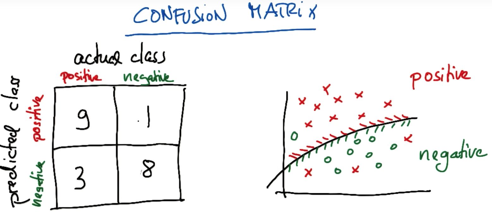
Another e.g. Red is positive and green is negative:
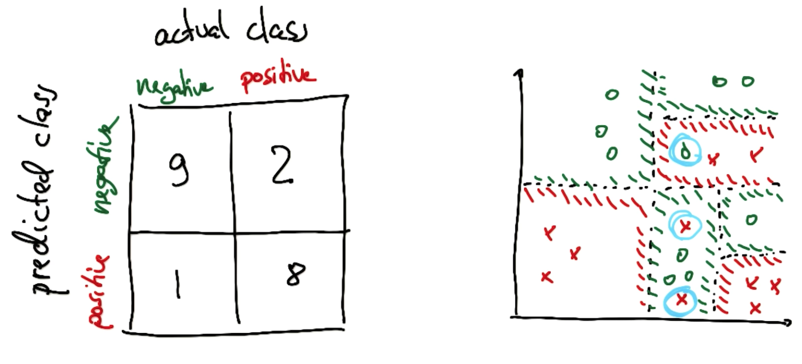

## Confusion matrix for Eigenface
Below is the matrix we get after running PCA and then using that in an SVM algorithm. The names on the right are the True Values and on top are the predicted values (Which is the same list of names). For example, G SChroeder was correctly identified 26 times and was predicted 15 times. All of the off diagonal elements relate to miss classifications.  
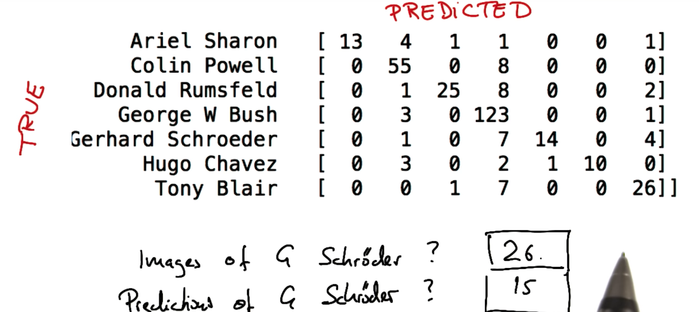

Suppose we're looking at an image of Hugo Chavez. What's the probability Hugo will be classified correctly by our algorithm? 
Cases of Hugo Chavez = 16 (3+2+1+10). Of those 16 cases there were 10 classified correctly.  
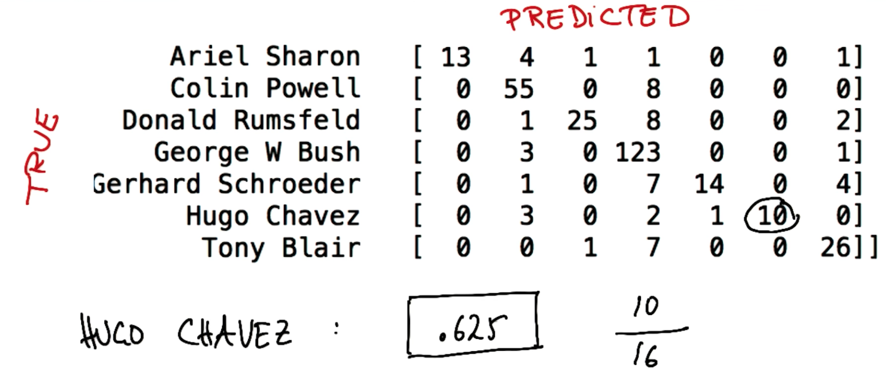

Wwhen you run your algorithm and it classifies it as Hugo Chavez What's the probabulity of it actually being him?
=> 100 % chance! That is if you look at all the cases where Hugo Chavez was recognised in the image by the algorithm 10 out of 10 cases it got it right. 
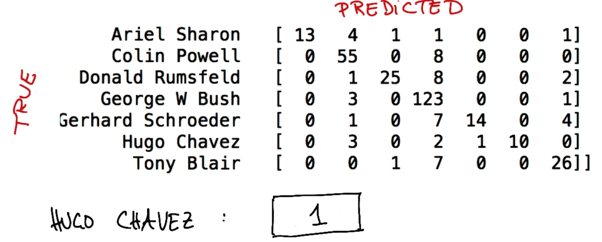

## Precision and recall
* **Recall:** True Positive / (True Positive + False Negative). Out of all the items that are truly positive, how many were correctly classified as positive. Or simply, how many positive items were 'recalled' from the dataset. For e.g. the Recall rate on Hugo Chavez is the  probability of our algorithm correctly identifying Hugo Chavez provided that the person actually is Hugo Chavez. So in our case it was 10/16.

* **Precision:** True Positive / (True Positive + False Positive). Out of all the items labeled as positive, how many truly belong to the positive class. The rate of which our algorithm predicted Hugo Chavez. It happened to be 10/10

Let's do another example of Recall and Precision with Colin Powell:
Recall: There are 63 incidences of Colin Powell in the data set of which we only get 55 right 55/63 = 0.87
Precision: Total of 67 cases where we identified Colin Powell and only 55 out of 67 are correctly classified 55/67 = 0.82
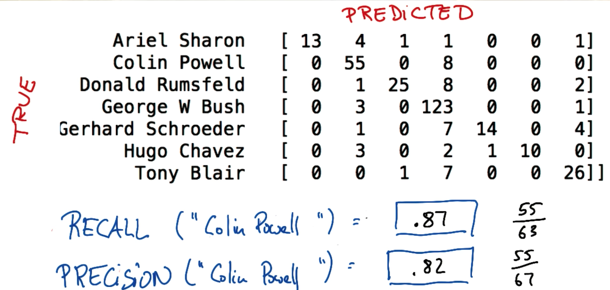

## True positives in Eigenfaces
For the case of Tony Blair identify the number of True positives, False positives (sum the predicted column where not True) and False negatives(sum the Tony Blair row where not True).
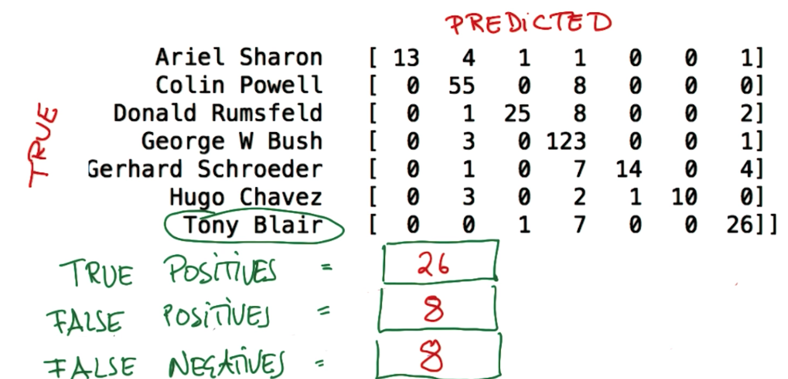

Let's do this for Donald Rumsfeld as well:
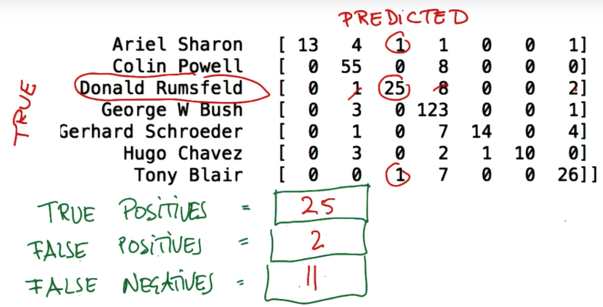

## Equation for precision
* Precision = (True positives)/(true positives + false positives)
* Recall = (True positives)/(true positives + false negatives)
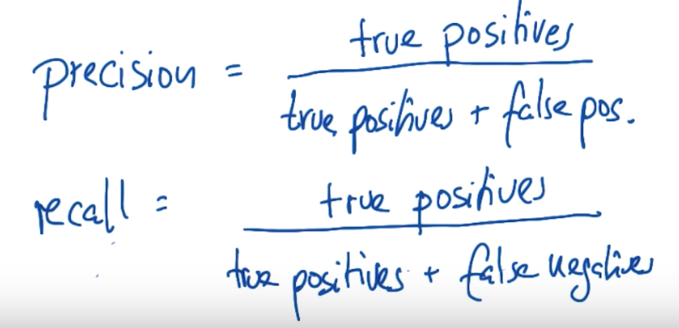

## F1 Score
The measure of a tests accuracy. It considers both the precision and the recall of the test to compute the score. The F1 score is the harmonic average of the precision and recall, where an F1 score reaches its best value at 1 (perfect precision and recall) and worst at 0.


## Mini project
* Go back to your code from the last lesson, where you built a simple first iteration of a POI identifier using a decision tree and one feature. Copy the POI identifier that you built into the skeleton code in evaluation/evaluate_poi_identifier.py. Recall that at the end of that project, your identifier had an accuracy (on the test set) of 0.724. Not too bad, right? Let’s dig into your predictions a little more carefully.

* How many POIs are predicted for the **test set** for your POI identifier?
* How many people total are in the test set?
```{python}
# Label 1 for POI and 0 for not POI

## quizes
print clf
print "Accuracy is {0}. ".format(accuracy)
print "{0} POIs in test set.".format(sum(labels_test)) # All POIs labelled 1
print "{0} POIs predicted in the test set.".format(sum(pred))
print "{0} people total in test set".format(len(features_test))
```
=> There are 4 POIs prdicted in the test set.
=> There are 29 people total in the test set.

* If your identifier predicted 0. (not POI) for everyone in the test set, what would its accuracy be?
=> Since there are 4 POIs in the test set if it predicted 0 POIs the accuracy would be 25/29=0.86 (Since it correctly identified 25 people as not being POIs)

* Look at the predictions of your model and compare them to the true test labels. Do you get any true positives? (In this case, we define a true positive as a case where both the actual label and the predicted label are 1)
=> Nope. We predicted 4 POIs but we have an accuracy of 0.72 so the 4 we were predicted were wrong. Could compare the two NumPy arrays to see if you get the same figures in each of the positions? 

* As you may now see, having imbalanced classes like we have in the Enron dataset (many more non-POIs than POIs) introduces some special challenges, namely that you can just guess the more common class label for every point, not a very insightful strategy, and still get pretty good accuracy!
Precision and recall can help illuminate your performance better. Use the precision_score and recall_score available in sklearn.metrics to compute those quantities.
What’s the precision?
```{python}
# Calculate precision and recall
from sklearn.metrics import precision_score
print "Precision score", precision_score(labels_test, pred)

from sklearn.metrics import recall_score
print "Recall score", recall_score(labels_test, pred)
```
=> Precision is 0
=> Recall is 0. 
Obviously this isn’t a very optimized machine learning strategy (we haven’t tried any algorithms besides the decision tree, or tuned any parameters, or done any feature selection), and now seeing the precision and recall should make that much more apparent than the accuracy did.

* In the final project you’ll work on optimizing your POI identifier, using many of the tools learned in this course. Hopefully one result will be that your precision and/or recall will go up, but then you’ll have to be able to interpret them. 
Here are some made-up predictions and true labels for a hypothetical test set; fill in the following boxes to practice identifying true positives, false positives, true negatives, and false negatives. Let’s use the convention that “1” signifies a positive result, and “0” a negative. 

predictions = [0, 1, 1, 0, 0, 0, 1, 0, 1, 0, 0, 1, 0, 0, 1, 1, 0, 1, 0, 1] 
true labels = [0, 0, 0, 0, 0, 0, 1, 0, 1, 1, 0, 1, 0, 1, 1, 1, 0, 1, 0, 0]

* How many true positives are there?
=> There are 6 true positives.

* How many true negatives are there in this example?
=> There are 9 true negatives.

* How many false positives are there?
=> There are 3 false positives.

* How many false negatives are there?
=> There are 2 false negatives. 

* What's the precision of this classifier?
=>  Precision = (True positives)/(true positives + false positives) = 6/9 = 0.666

* What's the recall of this classifier?
=> Recall = (True positives)/(true positives + false negatives) = 6/8 = 0.75

* Fill in the blank:
“My true positive rate is high, which means that when a ___ is present in the test data, I am good at flagging him or her.”
=> "POI"

* Fill in the blanks.
“My identifier doesn’t have great -, but it does have good -. That means that, nearly every time a POI shows up in my test set, I am able to identify him or her. The cost of this is that I sometimes get some false positives, where non-POIs get flagged.”
=> (i)"Precision" (ii)"Recall"

* Fill in the blanks.
“My identifier doesn’t have great _, but it does have good __. That means that whenever a POI gets flagged in my test set, I know with a lot of confidence that it’s very likely to be a real POI and not a false alarm. On the other hand, the price I pay for this is that I sometimes miss real POIs, since I’m effectively reluctant to pull the trigger on edge cases.”
=> (i) "Recall" (ii)"Precision"

* Fill in the blanks.
“My identifier has a really great _. 
This is the best of both worlds. Both my false positive and false negative rates are _, which means that I can identify POI’s reliably and accurately. If my identifier finds a POI then the person is almost certainly a POI, and if the identifier does not flag someone, then they are almost certainly not a POI.”
=> (i) "F1 Score" (ii)"low"

* There’s usually a tradeoff between precision and recall--which one do you think is more important in your POI identifier? There’s no right or wrong answer, there are good arguments either way, but you should be able to interpret both metrics and articulate which one you find most important and why.

***

# Tying it all together
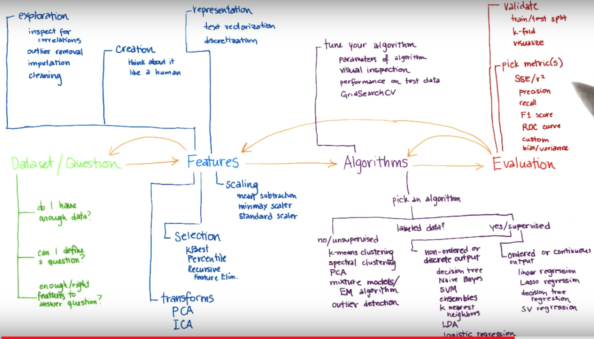

