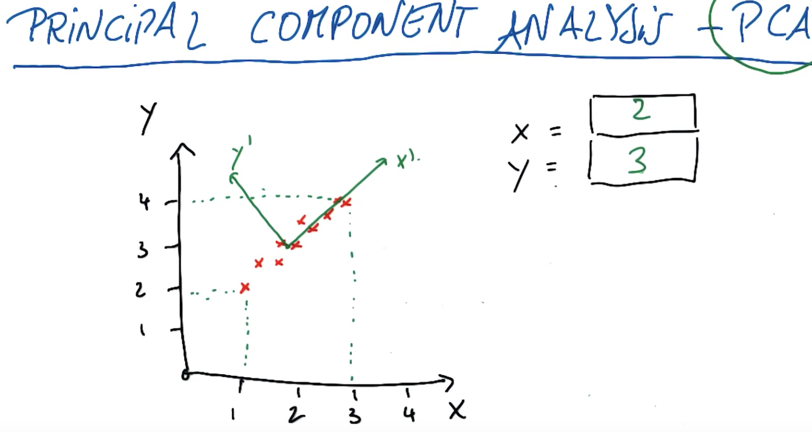
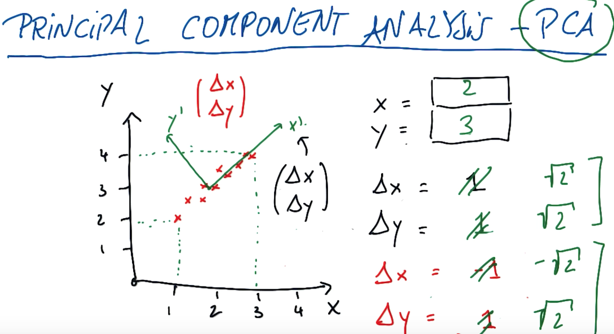
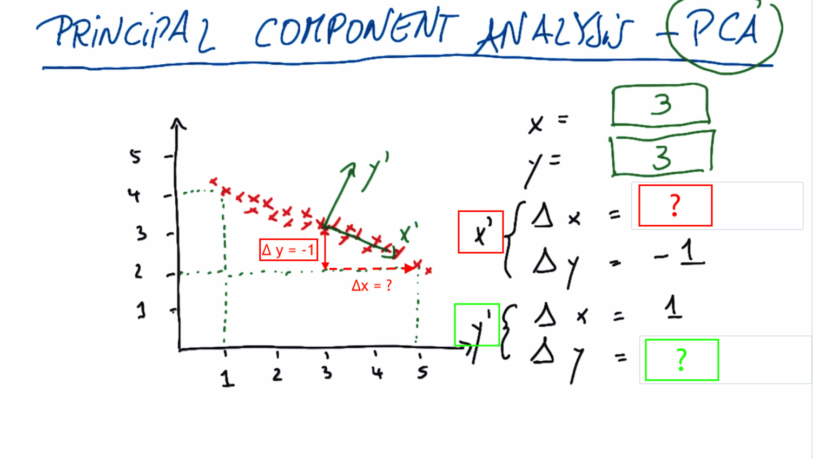
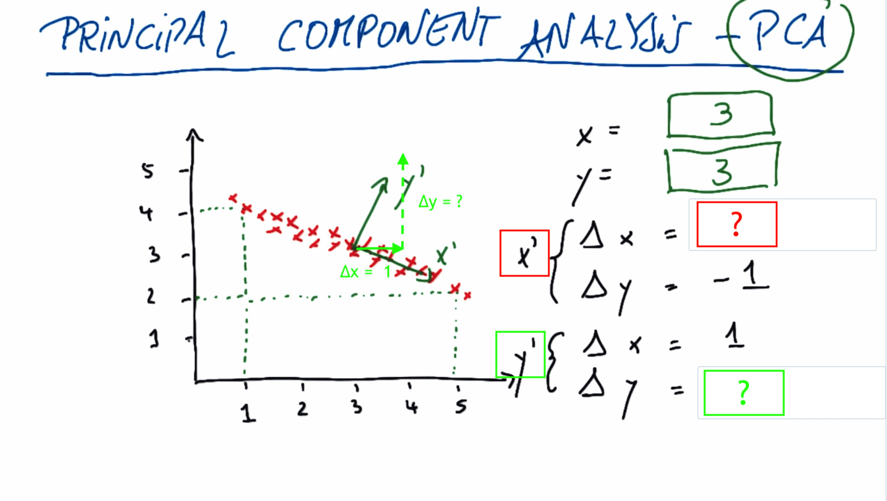
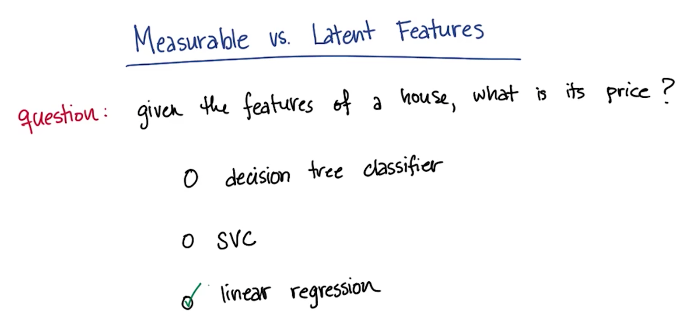
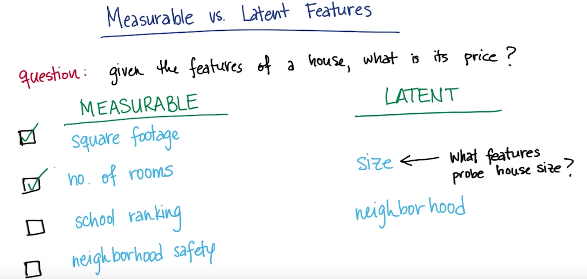

# Validation
Why use training and testing data?
* Serves as a check for overfitting
* Gives estimate of performance on an indpeendent dataset

## Train/Test in sklearn
We'll use a group of functions that fall under the title "Cross validation". Learning the parameters of a prediction function and testing it on the same data is a methodological mistake: a model that would just repeat the labels of the samples that it has just seen would have a perfect score but would fail to predict anything useful on yet-unseen data. This situation is called overfitting. To avoid it, it is common practice when performing a (supervised) machine learning experiment to hold out part of the available data as a test set.

In scikit-learn a random split into training and test sets can be quickly computed with the train_test_split helper function. Let’s load the iris data set to fit a linear support vector machine on it:
We can quickly sample a training set while holding out 40% of the data for testing (evaluating) our classifier:
```{python}
from sklearn import datasets
from sklearn.svm import SVC
from sklearn.model_selection import train_test_split

iris = datasets.load_iris()
features = iris.data
labels = iris.target

features_train, features_test, labels_train, labels_test = train_test_split(
...     iris.data, iris.target, test_size=0.4, random_state=0)


#train svm on training data
clf = SVC(kernel="linear", C=1.)
clf.fit(features_train, labels_train)

print clf.score(features_test, labels_test)
```

## Where to use training vs. testing


## K fold cross validation
There's a tradeoff with splitting your data for testing and training. We want as much data as possible for training our algorithm, but at the same tine we need plenty of data for validating our algorithm.

With cross validation you partition your dataset into k bins of equal size. For eg, if we have a datset with 200 points and 10 bins, each bin would have 20 data points. 
In k fold cross validation you run k seperate learning experiments. In each of those, you pick one of those k subsets as your testing set. The remaining k-1 bins are put together into the training set, then you train your machine learning algorithm and test the performance on the testing set. The key thing in cross validation is you run this multiple times. In thi case 10 times, and then you average the 10 different testing set performances for the 10 different hold out sets, so you average the test results from those k experiments. 
Obviously, this takes more computing time because you now have to run  k seperate learning experiments, but theassesment of the learning algorithm would be more accurate. So if your concern is to have minimum training time then you would do the traditional test/train procedure. 

## K fold in sklearn
Provides train/test indices to split data in train/test sets. Split dataset into k consecutive folds (without shuffling by default). Each fold is then used once as a validation while the k - 1 remaining folds form the training set.

If our original data comes in some sort of sorted fashion, then we will want to first shuffle the order of the data points before splitting them up into folds, or otherwise randomly assign data points to each fold. If we want to do this using KFold(), then we can add the "shuffle = True" parameter when setting up the cross-validation object.

```{python}
>>> from sklearn.model_selection import KFold
>>> X = np.array([[1, 2], [3, 4], [1, 2], [3, 4]])
>>> y = np.array([1, 2, 3, 4])
>>> kf = KFold(n_splits=2)
>>> kf.get_n_splits(X)
2
>>> print(kf)  
KFold(n_splits=2, random_state=None, shuffle=False)
>>> for train_index, test_index in kf.split(X):
...    print("TRAIN:", train_index, "TEST:", test_index)
...    X_train, X_test = X[train_index], X[test_index]
...    y_train, y_test = y[train_index], y[test_index]
TRAIN: [2 3] TEST: [0 1]
TRAIN: [0 1] TEST: [2 3]
```

If we have concerns about class imbalance, then we can use the StratifiedKFold() class instead. Where KFold() assigns points to folds without attention to output class, StratifiedKFold() assigns data points to folds so that each fold has approximately the same number of data points of each output class. This is most useful for when we have imbalanced numbers of data points in your outcome classes (e.g. one is rare compared to the others). For this class as well, we can use "shuffle = True" to shuffle the data points' order before splitting into folds.

## Cross validation for parameter tuning
### GridSearch in sklearn
GridSearchCV is a way of systematically working through multiple combinations of parameter tunes, cross-validating as it goes to determine which tune gives the best performance. The beauty is that it can work through many combinations in only a couple extra lines of code.
Here's an example from the sklearn documentation:
```{python}
parameters = {'kernel':('linear', 'rbf'), 'C':[1, 10]}
svr = svm.SVC()
clf = grid_search.GridSearchCV(svr, parameters)
clf.fit(iris.data, iris.target)
```
Let's break this down line by line.
```{python}
parameters = {'kernel':('linear', 'rbf'), 'C':[1, 10]} 
```
A dictionary of the parameters, and the possible values they may take. In this case, they're playing around with the kernel (possible choices are 'linear' and 'rbf'), and C (possible choices are 1 and 10).

Then a 'grid' of all the following combinations of values for (kernel, C) are automatically generated:
|('rbf', 1) | ('rbf', 10)|
|('linear', 1) |('linear', 10) |
Each is used to train an SVM, and the performance is then assessed using cross-validation.
```{python}
svr = svm.SVC()
```
This looks kind of like creating a classifier, just like we've been doing since the first lesson. But note that the "clf" isn't made until the next line--this is just saying what kind of algorithm to use. Another way to think about this is that the "classifier" isn't just the algorithm in this case, it's algorithm plus parameter values. Note that there's no monkeying around with the kernel or C; all that is handled in the next line.
```{python}
clf = grid_search.GridSearchCV(svr, parameters)
```
This is where the first bit of magic happens; the classifier is being created. We pass the algorithm (svr) and the dictionary of parameters to try (parameters) and it generates a grid of parameter combinations to try.
```{python}
clf.fit(iris.data, iris.target)
```
And the second bit of magic. The fit function now tries all the parameter combinations, and returns a fitted classifier that's automatically tuned to the optimal parameter combination. You can now access the parameter values via 
```{python}
clf.best_params_
```


## Mini project
In this mini-project, you’ll start from scratch in making a training-testing split in the data. This will be the first step toward your final project, of building a POI identifier.

* You’ll start by building the simplest imaginable (unvalidated) POI identifier. The starter code (validation/validate_poi.py) for this lesson is pretty bare--all it does is read in the data, and format it into lists of labels and features. Create a decision tree classifier (just use the default parameters), train it on all the data (you will fix this in the next part!), and print out the accuracy. THIS IS AN OVERFIT TREE, DO NOT TRUST THIS NUMBER! Nonetheless, what’s the accuracy?
```{python}
import pickle
import sys
sys.path.append("../tools/")
from feature_format import featureFormat, targetFeatureSplit
from sklearn import tree
import numpy as np
from sklearn.metrics import accuracy_score
from sklearn import cross_validation
data_dict = pickle.load(open("../final_project/final_project_dataset.pkl", "r") )

### first element is our labels, any added elements are predictor
### features. Keep this the same for the mini-project, but you'll
### have a different feature list when you do the final project.
features_list = ["poi", "salary"]

data = featureFormat(data_dict, features_list)
labels, features = targetFeatureSplit(data)
features_train, features_test, labels_train, labels_test = cross_validation.train_test_split(features, labels, test_size=0.3, random_state=42)

from sklearn import tree
from sklearn.metrics import accuracy_score

clf = tree.DecisionTreeClassifier()

clf = clf.fit(features_train, labels_train)
pred = clf.predict(features_test)
accuracy = accuracy_score(pred, labels_test)
print accuracy

clf_all = clf.fit(features, labels)
pred2 = clf_all.predict(features)
accuracy2 = accuracy_score(pred2, labels)
print accuracy2
```
=> The overfit data has an accuracy of 0.99

* Now you’ll add in training and testing, so that you get a trustworthy accuracy number. Use the train_test_split validation available in sklearn.cross_validation; hold out 30% of the data for testing and set the random_state parameter to 42 (random_state controls which points go into the training set and which are used for testing; setting it to 42 means we know exactly which events are in which set, and can check the results you get). What’s your updated accuracy?
=>(Answer also in code above. Now have an accuracy of 0.72)

***

# Evaluation metrics
Use evaluation metrics to tell if our algorithm is improving and how it's performing overall. 
 accuracy = (no. of all data points labeled correctly)/(all data points)
Some of the shortcomings for accuracy in terms of identofying POI with our Enron data include:
* Not ideal for skewed classes
* May want to err on side of guessing innocent (so we dont incrimate innocent people)
* May want to err on side of guessing guilty (so they can be investigated further before having their name cleared or not)

In many cases in real life you care about certain outcomes more than others. For e.g. if we write a cancer detection test we would care more about the cancer gets detected, even if you tolerate ocassional false detection, than overlooking cancer.  This is a case where a performance metric favours one type of error differently over another type of error. 
So depending on which metric you use it can help you zero in on what types of mistakes you might be making. And you can tune your algorithm for exactly what you want it to be optimised for. 

## Confusion matrix
A confusion matrix is a table that is often used to describe the performance of a classification model (or "classifier") on a set of test data for which the true values are known. Each row of the matrix represents the instances in a predicted class while each column represents the instances in an actual class (or vice versa)

Another e.g. Red is positive and green is negative:


* PCA finds a coordinate syatem that centres itself inside the data and aligns the x axis with the principal axis of variation. 
* In the image below PCA would coordinate the new centre to be at (2,3)

The X' axis is a vector in the old coordinate system which starts at (2,3). 

* Finding Δy given Δx=1 draw a line from the new origin and go across the old x axis by 1 and see what the change in y will be for it (change in old y axis when you draw a line up to the new X' axis). 

* Another e.g. using Y' axis. Find Δx and Δy. There's many different solutions but the best would be for Δx=-1 because we go left and Δy = 1. In reality when we write PCA what you find is lowest output vector is normalised to 1. So when you rescale these vectors you find that for the first one you'll get 1/(SQRT of 2) and so on. The total length will have a length of 1, because the total length is given by the square root of the squares of the sum.  **NOTE: In the image below where there is sqrt of 2 it should be 1/(sqrt 2).** 


* More practice: Find the new origin for the new axes (X' and Y') :

The origin for the new axes will be (3,3)

* Then fill in the Δx and Δy. In both cases, we start from (3,3). The center of the new coordinate system.
For each component, how is a change in the original coordinate system reflected in the new coordinate system?
X' :

Result: Δ y = -1 ⇒ Δ x = 2

Y' :

Result: Δ x = 1 ⇒ Δ y = 2
* Sidenote: If you did the dot product of these two vectors then you would get 0 which is a measure of orthoganality. 
* PCA also returns an importance value, a spread value for these axes. That spread value tends to be very large for the very first axis of variation (X') and much smaller for the second axis of variation (Y') if the spread is small. So this number happens to be an Eigenvalue. It comes out of an Eigenvalue decomposition thst's really implemented by PCA. But what it really gives you is an importance vector, how important to take each axis when you look at the data. So when you run the code you'll find the new origin, you'll find these different vectors and you'll find the importance value if given to these vectors that really measures the amount of spread. 

* Quiz: (i) Does the principal componant analysis return a result for each of the graphs?

The answer is yes in all cases. Part of the beauty of PCA is that the data doesn't have to be perfectly 1D in order to find the principal axis! 
Now, the clear cut case is the left one, which is the one we already discussed. 
But if we have data on a circle (2nd graph) there could still be a main axis and a secondary axis and PCA could give you a deterministic result.
The third one is surprising. When we remember regression, it's impossible to build a regression that goes vertically because you can't really divide this data set here as a fxn y = f(x). But regression treats the variables asymmetrically. One is the input, one is the output. In PCA all we get is vectors. So I can easily imagine a coordinate syste, where the x axis falls vertically, and the y axis goes to the left, and that's the answer for PCA in this case.

* * Quiz: (ii): Does the major axis dominate? By dominate, we mean that the kind of importance value, or the eigenvalue of the major axis is vastly larger than the one of the minor axis. 

First graph: Yes. Once you capture the spread in the dominant direction there isn't much left in the orthogonal direction. 
Second graph: No. The minor axis as spread as the major axis. In fact in this case I would assume that both Eigenvalues are of the same magnitude and we really haven't gained much by running PCA. 
Third graph: Yes. The dominance is really clear here where the major axis really captures all of it and there's really nothing left in the minor axis.

## Intuition for what you do when you use PCA
Q: Which algorithm would you use to find the price of a house given it's features.

This is a classic regression exercise because the output that we expect to get is going to be continuous. So it's not appropriate to use a classifier. We want to use something like a regression that can give us a number as an output, where the number's the price of the house. 
When you're making your regression to determine the price of a house, there's going to be a number of input features that you might potentially be interested in(e.g. square footage, no. of rooms, school ranking, neighbourhood safety). I would argue when you're making these measurements yur really just probing 2 things even though we have 4 features here. You're probing the size of the home and you're asking questions about the neighbourhood. These are 2 examples of latent variables. These are variables that you can't measure directly, but that are sort of driving the phenomenin that you're measuring behind the scenes.


## Compression while preserving information
So now that we know that we have potentially a large number of measurable features, but maybe a small number of underlying latent features that contain most of the information. So what's the best way to condense our features to 2 so that we really get to the heart of the information? So we're really probing size and the neighbourhood. One way to get at this is with just simple feature selection. If you put these 4 features into a feature selection tool, maybe it would keep the square footage, but throw away the number of rooms. Which of the feature selection tools do you think would be most suitable for this? 
SelectPercetile just selects the top X percent where you're allowed to specify the % of features you'd like to keep. SelectKBest - as one of the arguments you specify what k is(the number of features ou want to keep).
Let's get rid of the knowledge we already have 4 features. Let's suppose the number of features you have available to you isn't something that you know very well. But you do know that the size and the neighbourhood are going to be underlying latent variables that are sort of driving the trends in all of the features that you have available to you. So the question is, if you want to have 2 output features, what's the most suitable feature selection tool in this scenario? 

SelectKBest is probably going to be the best answer here, because you know exactly how many you're expecting to get out so it will throw away all of the features except the 2 that are most powerful. SelectPercentile wasn't as good of a choice in this case where we didn't know exactly how many features we had. 


